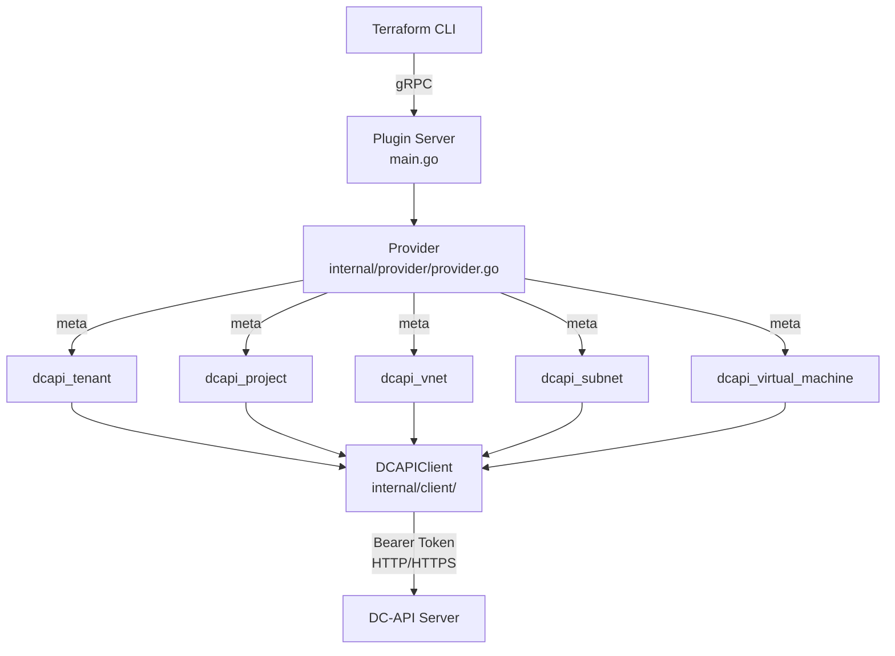
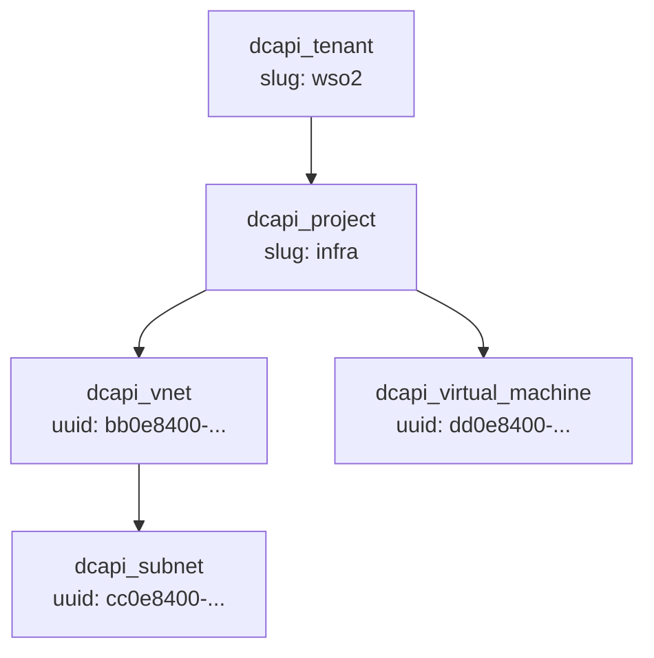
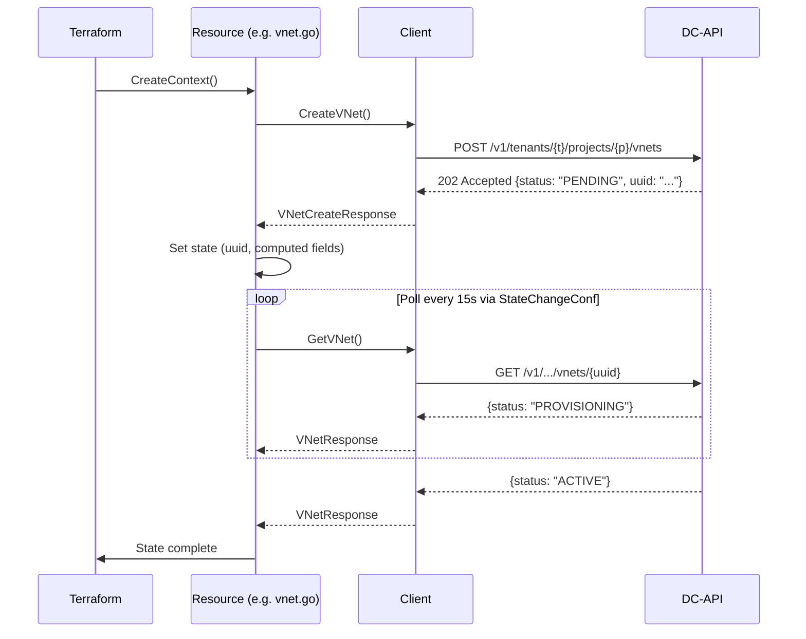

# Terraform Provider for DC-API (WSO2 Sovereign Cloud)

A Terraform provider for managing resources on WSO2's internal DC-API cloud platform. Supports tenants, projects, virtual networks, subnets, and virtual machines.

---

## Architecture

### Provider Architecture



### Resource Hierarchy

Resources must be created in dependency order — each child resource requires its parent to exist first.



### Async Operation Lifecycle

Most create and delete operations return HTTP 202 Accepted. The provider polls until the resource reaches a terminal state.



### State ID Encoding

Each resource encodes its Terraform state ID as a composite path that mirrors the DC-API URL structure:

| Resource | State ID Format | Example |
|---|---|---|
| `dcapi_tenant` | `slug` | `wso2` |
| `dcapi_project` | `tenant/project` | `wso2/infra` |
| `dcapi_vnet` | `tenant/project/vnet_uuid` | `wso2/infra/bb0e8400-...` |
| `dcapi_subnet` | `tenant/project/vnet_uuid/subnet_uuid` | `wso2/infra/bb0e8400-.../cc0e8400-...` |
| `dcapi_virtual_machine` | `tenant/project/vm_uuid` | `wso2/infra/dd0e8400-...` |

---

## Prerequisites

- [Terraform](https://developer.hashicorp.com/terraform/downloads) >= 1.0
- [Go](https://go.dev/dl/) >= 1.21 (for building from source)
- A valid DC-API service account token (`dcapi_sa_<lookup_id>_<secret>`)
- Access to a DC-API endpoint (e.g., `https://dcapi.lk.internal.wso2.com`)

---

## Installation

### Build and Install Locally

```bash
git clone https://github.com/wso2/sovereign-cloud-terraform-provider.git
cd sovereign-cloud-terraform-provider

make install
```

This compiles the provider and copies it to:
```
~/.terraform.d/plugins/registry.terraform.io/wso2/dcapi/0.1.0/<OS>_<ARCH>/
```

Then reference it in your `terraform.tf`:

```hcl
terraform {
  required_providers {
    dcapi = {
      source  = "registry.terraform.io/wso2/dcapi"
      version = "0.1.0"
    }
  }
}
```

---

## Provider Configuration

```hcl
provider "dcapi" {
  endpoint = "https://dcapi.lk.internal.wso2.com"
  token    = "dcapi_sa_<lookup_id>_<secret>"
}
```

Or use environment variables (recommended — avoids committing credentials):

```bash
export DCAPI_ENDPOINT="https://dcapi.lk.internal.wso2.com"
export DCAPI_TOKEN="dcapi_sa_<lookup_id>_<secret>"
```

```hcl
provider "dcapi" {}
```

### Provider Arguments

| Argument | Type | Required | Env Var | Description |
|---|---|---|---|---|
| `endpoint` | string | yes | `DCAPI_ENDPOINT` | Base URL of the DC-API server |
| `token` | string | yes | `DCAPI_TOKEN` | Service account bearer token |

---

## Resources

### `dcapi_tenant`

Registers a tenant in DC-API. Deletion only removes the resource from Terraform state — the tenant itself is not deleted via API.

```hcl
resource "dcapi_tenant" "example" {
  tenant_id   = "wso2"       # immutable, must match ^[a-z][a-z0-9-]{0,30}[a-z0-9]$
  name        = "WSO2"
  description = "WSO2 main tenant"

  cpu_cores_cap  = 160   # updatable, 0 = platform default
  memory_gb_cap  = 512
  storage_gb_cap = 4000
}
```

**Computed outputs:** `tenant_uuid`, `asgardeo_group`, `created_at`, `created_by`

---

### `dcapi_project`

Creates a project within a tenant. Deletion fails with a 409 if child VNets or VMs still exist.

```hcl
resource "dcapi_project" "example" {
  tenant_id  = dcapi_tenant.example.tenant_id
  project_id = "infra"

  name        = "Infrastructure"
  description = "Core networking project"

  cpu_cores  = 20    # updatable
  memory_gb  = 64
  storage_gb = 500

  max_vnets      = 10   # immutable, platform limits
  max_clusters   = 2
  max_volumes    = 50
  max_public_ips = 3
}
```

**Computed outputs:** `project_uuid`

---

### `dcapi_vnet`

Creates a Virtual Network (VPC). All fields are immutable — changes force replacement. Creation is asynchronous (polls until `ACTIVE`).

```hcl
resource "dcapi_vnet" "example" {
  tenant_id  = dcapi_project.example.tenant_id
  project_id = dcapi_project.example.project_id

  name          = "my-vpc"
  address_space = ["10.1.0.0/16"]   # up to 5 non-contiguous CIDR ranges
  region        = "lk"
  description   = "Main VPC"
}
```

**Computed outputs:** `vnet_uuid`, `status`, `provider_type`, `created_at`, `updated_at`

---

### `dcapi_subnet`

Creates a subnet within a VNet. All fields are immutable — changes force replacement. Deletion of the last subnet triggers NAT/CoreDNS cleanup (adds 10–15 min to delete time).

```hcl
resource "dcapi_subnet" "app" {
  tenant_id  = dcapi_vnet.example.tenant_id
  project_id = dcapi_vnet.example.project_id
  vnet_id    = dcapi_vnet.example.vnet_uuid

  name        = "app-subnet"
  cidr        = "10.1.1.0/24"   # must fall within parent VNet address_space
  gateway     = "10.1.1.1"      # optional, API assigns first usable IP if omitted
  description = "Application tier subnet"
}
```

**Computed outputs:** `subnet_uuid`, `status`, `provider_type`, `created_at`, `updated_at`

---

### `dcapi_virtual_machine`

Creates a VM. Supports two networking modes — use one or the other, not both.

**VPC mode (recommended):**
```hcl
resource "dcapi_virtual_machine" "web" {
  tenant_id  = dcapi_subnet.app.tenant_id
  project_id = dcapi_subnet.app.project_id

  name       = "web-01"
  size       = "medium"                          # small | medium | large | xlarge
  image_name = "rancher-infra/ubuntu-22-04"

  vnet_id   = dcapi_vnet.example.vnet_uuid       # VPC mode
  subnet_id = dcapi_subnet.app.subnet_uuid
}
```

**Legacy bridge mode:**
```hcl
resource "dcapi_virtual_machine" "legacy" {
  tenant_id  = dcapi_project.example.tenant_id
  project_id = dcapi_project.example.project_id

  name         = "legacy-01"
  size         = "small"
  image_name   = "rancher-infra/ubuntu-22-04"
  network_name = "iaas/vm-network-001"            # bridge mode
}
```

**Computed outputs:** `vm_uuid`, `vm_ip`, `private_key` (sensitive), `console_password` (sensitive)

> **Important:** `private_key` and `console_password` are returned by the API only at creation time. They are stored in Terraform state as sensitive values and never re-fetched. Back them up before destroying the resource.

---

## Full Example

This example provisions the full resource stack end-to-end:

```hcl
terraform {
  required_providers {
    dcapi = {
      source  = "registry.terraform.io/wso2/dcapi"
      version = "0.1.0"
    }
  }
}

provider "dcapi" {}   # reads DCAPI_ENDPOINT and DCAPI_TOKEN from env

resource "dcapi_tenant" "main" {
  tenant_id      = "wso2"
  name           = "WSO2"
  cpu_cores_cap  = 160
  memory_gb_cap  = 512
  storage_gb_cap = 4000
}

resource "dcapi_project" "infra" {
  tenant_id  = dcapi_tenant.main.tenant_id
  project_id = "infra"
  name       = "Infrastructure"
  cpu_cores  = 20
  memory_gb  = 64
  storage_gb = 500
}

resource "dcapi_vnet" "vpc" {
  tenant_id     = dcapi_project.infra.tenant_id
  project_id    = dcapi_project.infra.project_id
  name          = "main-vpc"
  address_space = ["10.1.0.0/16"]
  region        = "lk"
}

resource "dcapi_subnet" "app" {
  tenant_id  = dcapi_vnet.vpc.tenant_id
  project_id = dcapi_vnet.vpc.project_id
  vnet_id    = dcapi_vnet.vpc.vnet_uuid
  name       = "app-subnet"
  cidr       = "10.1.1.0/24"
}

resource "dcapi_virtual_machine" "web" {
  tenant_id  = dcapi_subnet.app.tenant_id
  project_id = dcapi_subnet.app.project_id
  name       = "web-01"
  size       = "medium"
  image_name = "rancher-infra/ubuntu-22-04"
  vnet_id    = dcapi_vnet.vpc.vnet_uuid
  subnet_id  = dcapi_subnet.app.subnet_uuid
}

output "vm_ip" {
  value = dcapi_virtual_machine.web.vm_ip
}

output "vm_private_key" {
  value     = dcapi_virtual_machine.web.private_key
  sensitive = true
}
```

---

## Development

### Build

```bash
make build     # compile to ./terraform-provider-dcapi
make install   # build + install to ~/.terraform.d/plugins/
make clean     # remove compiled binary
```

### Project Layout

```
.
├── main.go                      # Plugin server entry point
├── GNUmakefile                  # Build automation
├── internal/
│   ├── provider/
│   │   └── provider.go          # Provider schema & resource registration
│   ├── client/
│   │   ├── client.go            # HTTP client (auth, error handling)
│   │   ├── tenant.go            # Tenant API calls
│   │   ├── project.go           # Project API calls
│   │   ├── vnet.go              # VNet API calls
│   │   ├── subnet.go            # Subnet API calls
│   │   └── vm.go                # VM API calls
│   └── resources/
│       ├── tenant.go            # dcapi_tenant resource
│       ├── project.go           # dcapi_project resource
│       ├── vnet.go              # dcapi_vnet resource
│       ├── subnet.go            # dcapi_subnet resource
│       └── vm.go                # dcapi_virtual_machine resource
├── examples/
│   ├── provider/main.tf
│   ├── tenant/main.tf
│   ├── project/main.tf
│   ├── vnet/main.tf
│   ├── subnet/main.tf
│   └── vm/main.tf
└── docs/
    └── dc-api-reference.md
```

### Adding a New Resource

1. Add API call methods to a new file in `internal/client/`
2. Implement the Terraform resource in `internal/resources/` with `CreateContext`, `ReadContext`, `UpdateContext`, `DeleteContext`
3. Register the resource in `internal/provider/provider.go` under `ResourcesMap`
4. Add an example under `examples/<resource>/main.tf`

---

<!-- ## Known Limitations

- **Tenant delete** is a no-op — the tenant is removed from state but not deleted via the API.
- **All VNet and Subnet fields** are immutable (`ForceNew`) — any change destroys and recreates the resource.
- **VM secrets** (`private_key`, `console_password`) are only available immediately after creation.
- **Last subnet deletion** can take up to 15 extra minutes due to NAT gateway and CoreDNS cleanup.
- **Project deletion** returns HTTP 409 if child resources (VNets, VMs) still exist — destroy children first. -->
