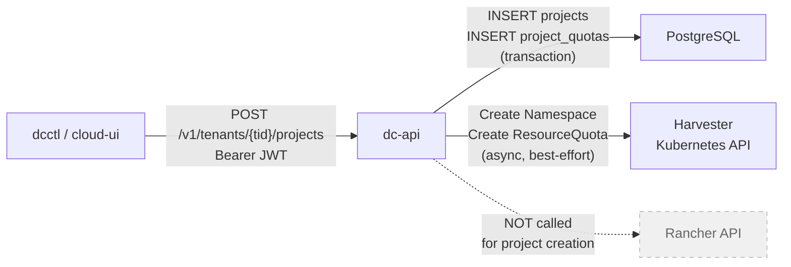
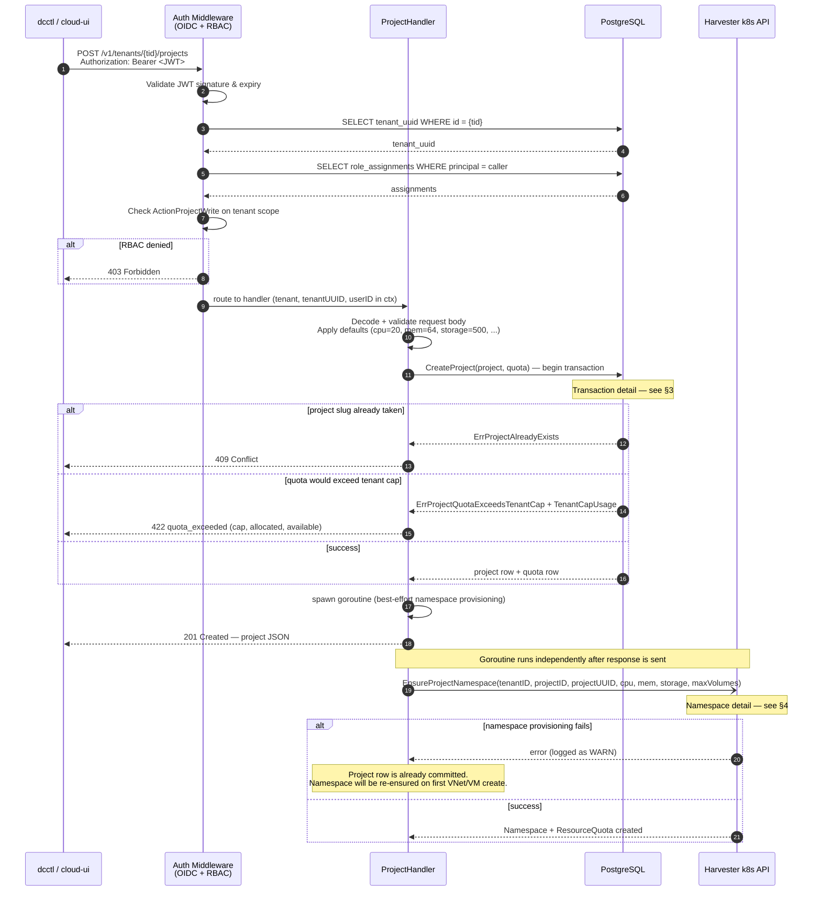
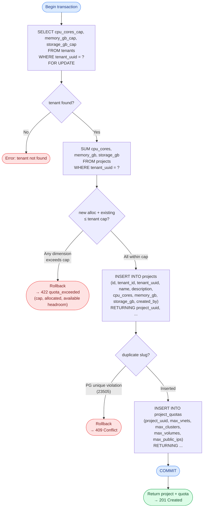
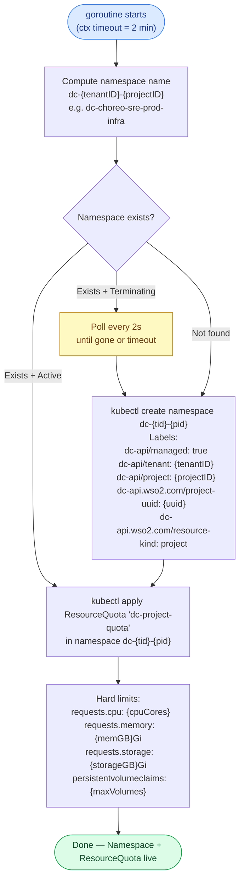
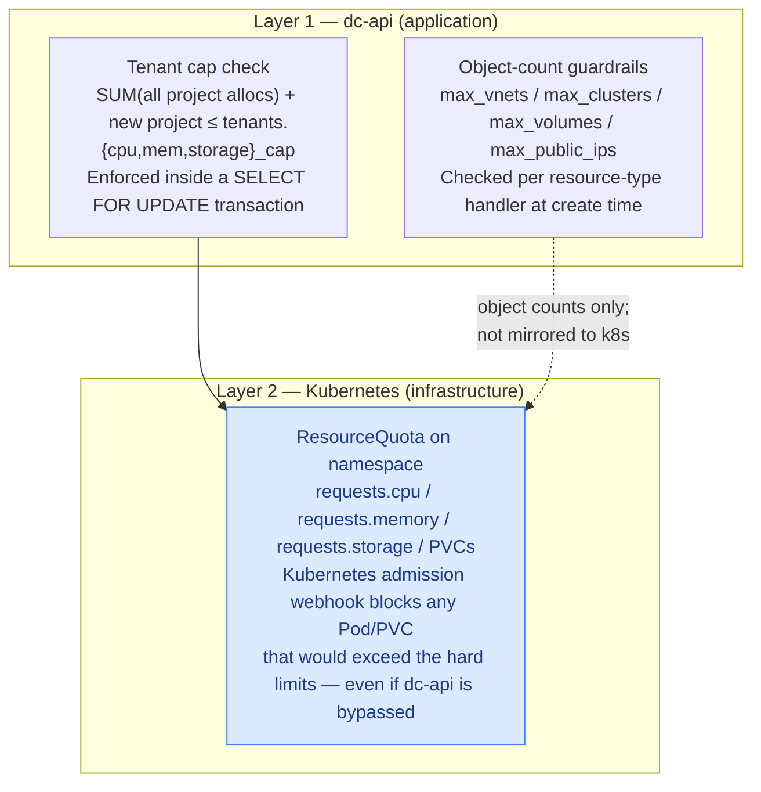

# Project Creation — How It Works

`POST /v1/tenants/{tenant_id}/projects` is the entry point. This document
explains every layer it touches, what gets created where, and the guarantees
and trade-offs involved.

---

## 1. System Context



Rancher is **not involved** in project creation. dc-api talks directly to the
Harvester cluster's Kubernetes API for namespace and quota provisioning.

---

## 2. End-to-End Request Flow



---

## 3. Database Transaction Detail

The `CreateProject` call runs inside a single PostgreSQL transaction with
`SELECT FOR UPDATE` on the tenant row to serialize concurrent creates.



**Why `SELECT FOR UPDATE`?**  Two concurrent `POST /projects` calls for the same
tenant can both pass the `SUM ≤ cap` check independently and jointly breach the
cap. The row-level lock on the tenant row serializes them — the second transaction
blocks until the first commits, then re-reads the updated sum.

---

## 4. Kubernetes Namespace Provisioning

This step runs in a background goroutine after the HTTP response is already sent.
It has a **2-minute timeout** and is **best-effort** — failure is logged but does
not roll back the project row.



**Idempotent:** `EnsureProjectNamespace` is a create-or-patch — it can safely be
called multiple times (e.g. on the first VNet or VM create if the initial goroutine
failed). The ResourceQuota is patched to the current project quotas on every call,
so a subsequent `PATCH /projects/{pid}` quota change also calls this to sync the
k8s ResourceQuota.

---

## 5. Objects Created — Summary

```mermaid
erDiagram
    POSTGRESQL {
        uuid   project_uuid PK
        string id           "slug, unique per tenant"
        uuid   tenant_uuid  FK
        int    cpu_cores
        int    memory_gb
        int    storage_gb
        string created_by
    }

    PROJECT_QUOTAS {
        uuid project_uuid PK_FK
        int  max_vnets
        int  max_clusters
        int  max_volumes
        int  max_public_ips
    }

    K8S_NAMESPACE {
        string name        "dc-{tenantID}-{projectID}"
        label  managed     "dc-api/managed: true"
        label  tenant      "dc-api/tenant"
        label  project     "dc-api/project"
        label  uuid        "dc-api.wso2.com/project-uuid"
    }

    K8S_RESOURCEQUOTA {
        string name            "dc-project-quota"
        string namespace       "dc-{tenantID}-{projectID}"
        string requests_cpu    "e.g. 20"
        string requests_memory "e.g. 64Gi"
        string requests_storage "e.g. 500Gi"
        int    pvcs            "max_volumes"
    }

    POSTGRESQL ||--|| PROJECT_QUOTAS : "cascade"
    K8S_NAMESPACE ||--|| K8S_RESOURCEQUOTA : "owns"
```

---

## 6. Quota Enforcement — Two Layers

Project creation enforces quotas at two levels. Both must pass.



The Kubernetes `ResourceQuota` is defense-in-depth: even if workloads are
submitted directly to the Harvester API (bypassing dc-api), the namespace quota
blocks any overcommit.

---

## 7. Error States and Recovery

| Scenario | dc-api response | State after | Recovery |
|---|---|---|---|
| Project slug already used in this tenant | `409 Conflict` | No rows written | Client chooses a different slug |
| New project quota + existing allocation exceeds tenant cap | `422 quota_exceeded` with headroom detail | No rows written | Admin raises tenant cap or reduce quota request |
| DB insert succeeds but Kubernetes API unreachable | `201 Created` | Project row committed; namespace absent | Auto-retried on first VNet/VM create via `EnsureProjectNamespace` |
| DB insert succeeds; namespace in `Terminating` state | `201 Created` | Goroutine polls up to 2 min | Creates namespace once old one finishes terminating; times out gracefully |
| Concurrent `POST /projects` race on same tenant | One wins, one gets serialized by `SELECT FOR UPDATE` | Both checked against live cap | No double-booking possible |
