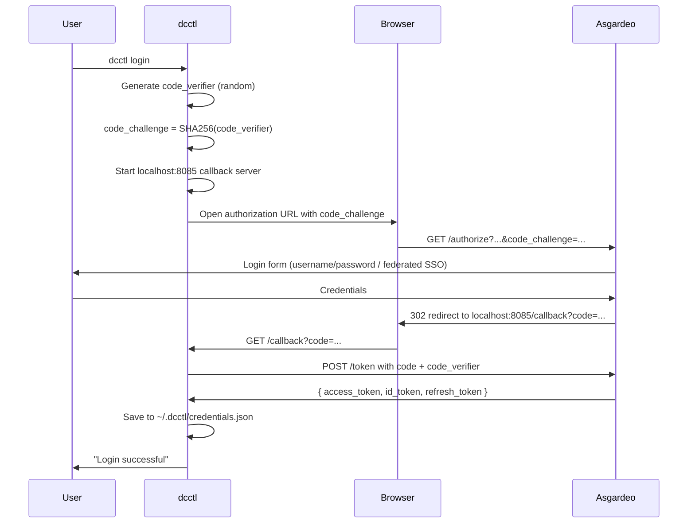

# 1. Document Purpose

This document describes how DC-API is built — the components that make it up, where they sit, how they communicate, and how the major user-visible flows work end-to-end. It is intended for engineers joining the project and for anyone reviewing the technical design. It deliberately reflects the **current implementation** (M1, plus M1.5 RBAC in design) rather than future milestones; the roadmap lives in `MILESTONES.md`.

For the *why* (the case for building DC-API at all), see `dc-api-internal-proposal.md`. This document is the *what* and the *how*.

> Diagrams in this document use a mix of ASCII (component layouts, deployment topology) and Mermaid (sequence flows). Mermaid blocks render natively on GitHub, mermaid.live, or via the `mermaid-filter` pandoc plugin. For Google Docs, render the Mermaid blocks at mermaid.live and paste images.

---

# 2. System Overview

DC-API is a Go REST service that gives WSO2 engineering teams a self-service cloud experience on top of the LK Datacenter. It hides Harvester (the hypervisor) and Rancher (the cluster manager) entirely from tenants. Three clients consume it: the `dcctl` CLI (built), a forthcoming Terraform provider, and a forthcoming web portal. PostgreSQL is the system of record. Asgardeo provides authentication via OIDC.

```
                                ┌──────────────────────────────┐
                                │       Asgardeo (OIDC)        │
                                │   Authentication & groups    │
                                └──────────────┬───────────────┘
                                               │ JWT validation
                                               │ (JWKS fetch on startup)
                                               ▼
   ┌──────────────┐         HTTPS        ┌─────────────┐         ┌──────────────────┐
   │   dcctl      │ ───── Bearer JWT ──► │             │ ──────► │   PostgreSQL     │
   │  (CLI)       │                      │             │ ◄────── │  (state, audit,  │
   └──────────────┘                      │   DC-API    │         │   quotas)        │
   ┌──────────────┐                      │  (Go REST)  │         └──────────────────┘
   │ Terraform    │ ───── Bearer JWT ──► │             │
   │ Provider     │                      │             │ ──────► ┌──────────────────┐
   │ (planned)    │                      │             │ ◄────── │   Harvester      │
   └──────────────┘                      │             │         │  (KubeVirt VMs   │
   ┌──────────────┐                      │             │         │   via dynamic    │
   │  Web UI      │ ───── Bearer JWT ──► │             │         │   k8s client)    │
   │ (planned)    │                      │             │         └──────────────────┘
   └──────────────┘                      │             │
                                         │             │ ──────► ┌──────────────────┐
                                         │             │ ◄────── │   Rancher        │
                                         │             │         │  (RKE2 clusters  │
                                         │             │         │   via REST v3)   │
                                         └─────────────┘         └──────────────────┘
```

The key design principle: **DC-API owns the contract.** Whatever happens behind the scenes with Rancher/Harvester is implementation detail. Replacing Harvester with OpenStack tomorrow does not change the API surface. Replacing Asgardeo with a different OIDC provider does not change the API surface. This is enforced through the Strategy Pattern (see §5).

---

# 3. Components

## 3.1 DC-API server

A Go 1.26 REST service. Single binary. Stateless — all state lives in PostgreSQL. Deployed as a Kubernetes Deployment (1 replica today; 2+ for HA when LK dev stabilises) on the `dcapi-controlplane-rke2` cluster running inside Harvester.

Responsibilities:

- Validates Asgardeo JWTs on every `/v1/*` request
- Enforces per-tenant quotas before any backend call
- Generates SSH keys for VMs (returned once to the caller, never stored)
- Proxies state-changing operations to the appropriate provider (Harvester or Rancher)
- Owns a PostgreSQL row for every resource it manages
- Runs a background reconciler that polls providers and syncs state into PostgreSQL

Key tech: chi router, zerolog structured logging, pgx for PostgreSQL, `client-go` dynamic client for Harvester, plain `net/http` for Rancher.

## 3.2 dcctl CLI

A Go 1.22 Cobra-based CLI. Built artifact distributed to engineers. Authenticates via OIDC PKCE (no client secret embedded — the binary is public). Stores the access token at `~/.dcctl/credentials.json` and configuration at `~/.dcctl/config.yaml`.

Commands today: `login`, `logout`, `create vm|cluster|image`, `list vms|clusters|images`, `get vm|cluster`, `delete vm|cluster`, `kubeconfig`. Output formats: `text` (default) and `json`.

## 3.3 PostgreSQL (state of record)

Three tables: `resources` (one row per VM/cluster/volume), `audit_events` (append-only state-change log), `quotas` (per-tenant limits). UUID primary keys; JSONB metadata column on `resources` to avoid schema migrations for each new field. Schema lives at `dc-api/internal/db/schema.sql`. Migration runner applies it on startup if tables don't exist.

## 3.4 Harvester (compute backend)

The hypervisor. DC-API talks to Harvester through the **Kubernetes dynamic client** because Harvester resources are CRDs (KubeVirt `VirtualMachine`, `harvesterhci.io/VirtualMachineImage`, etc.) — there is no Harvester REST API or Go SDK. The Harvester driver lives at `dc-api/internal/providers/harvester/client.go`.

## 3.5 Rancher (cluster backend)

Cluster lifecycle (RKE2 provisioning, kubeconfig retrieval). DC-API talks to Rancher via the **REST v3 API** over plain HTTPS, NOT through the rancher2 Terraform provider (which has known RKE2 cluster creation bugs). The Rancher driver lives at `dc-api/internal/providers/rancher/client.go`.

## 3.6 Asgardeo (identity)

Single OIDC provider for the whole platform. DC-API trusts exactly one issuer. Tenant isolation is enforced by DC-API's own role_assignments registry (invite-based membership, evaluated per request in code — not in Rancher configuration, and not via IdP groups). Enterprise tenants use Asgardeo's federation capability for corporate SSO; DC-API still sees a single trusted issuer.

## 3.7 GitHub Actions ARC runner (CI/CD)

A self-hosted runner (`actions-runner-controller`, scale-set model) runs in-cluster on the same RKE2 cluster as DC-API. Deploy workflow on push to `main` builds the image, pushes to ghcr.io, and rolls out the new deployment using the runner pod's mounted ServiceAccount token. No external `KUBECONFIG` secret is needed — the runner is in-cluster.

---

# 4. Code Structure

```
sovereign-cloud/
├── dc-api/                              ← The Go REST server
│   ├── cmd/dc-api/main.go               ← Entry point: env loading, signal handling, graceful shutdown
│   ├── go.mod                           ← module: github.com/wso2/dc-api, go 1.26
│   ├── Dockerfile                       ← Multi-stage; ships distroless/static:nonroot
│   ├── deploy/
│   │   ├── deployment.yaml              ← Kubernetes Deployment + Service
│   │   ├── ingress.yaml                 ← nginx Ingress for dcapi.lk.internal.wso2.com
│   │   ├── ingress-lb.yaml              ← LoadBalancer service for nginx ingress
│   │   ├── postgres.yaml                ← PostgreSQL StatefulSet + PVC (Harvester CSI)
│   │   ├── configmap.yaml               ← Non-secret config (DCAPI_OIDC_ISSUER etc.)
│   │   ├── runner-rbac.yaml             ← ServiceAccount + RBAC for the ARC runner
│   │   ├── arc-runner-values.yaml       ← Helm values for the runner scale-set
│   │   └── create-secrets.sh            ← Interactive script for sensitive env vars
│   └── internal/
│       ├── config/config.go             ← All DCAPI_* env var loading (12-factor)
│       ├── models/resource.go           ← Domain types: Resource, VMSpec, ClusterSpec, Quota
│       ├── db/
│       │   ├── schema.sql               ← PostgreSQL DDL
│       │   ├── db.go                    ← Repository pattern: all SQL queries live here
│       │   └── migrate.go               ← Applies schema on startup if missing
│       ├── providers/
│       │   ├── interface.go             ← ComputeProvider + ClusterProvider (Strategy Pattern)
│       │   ├── factory.go               ← Returns the concrete driver based on env config
│       │   ├── harvester/client.go      ← Kubernetes dynamic client → KubeVirt CRDs
│       │   └── rancher/client.go        ← Rancher REST v3
│       ├── api/
│       │   ├── middleware/auth.go       ← JWT validation; injects tenantID into context
│       │   ├── handlers/
│       │   │   ├── vm.go                ← /v1/virtual-machines, /v1/images, /v1/networks
│       │   │   └── cluster.go           ← /v1/clusters
│       │   └── router.go                ← Composition root: chi, middleware, route mounting
│       └── reconciler/
│           └── reconciler.go            ← Background goroutine: PENDING/DELETING → real state
│
├── dcctl/                               ← The Cobra CLI
│   ├── main.go
│   ├── go.mod                           ← module: github.com/wso2/dcctl, go 1.22
│   ├── cmd/                             ← One file per command (root, login, logout, etc.)
│   └── internal/
│       ├── auth/oidc.go                 ← PKCE flow: code_verifier/challenge, callback server
│       ├── config/config.go             ← ~/.dcctl/config.yaml + ~/.dcctl/credentials.json
│       └── client/client.go             ← HTTP client; injects Bearer token automatically
│
├── docs/                                ← Proposal docs, runbooks, this doc
└── MILESTONES.md                        ← Roadmap
```

---

# 5. Design Patterns

| Pattern | Where it lives | What it gives us |
|---|---|---|
| **Strategy** | `internal/providers/interface.go` | Handlers depend on `ComputeProvider` / `ClusterProvider` interfaces only. Swapping Harvester for OpenStack means writing one new struct; nothing else changes. |
| **Factory** | `internal/providers/factory.go` | `NewComputeProvider(cfg)` returns the right driver based on `DCAPI_VM_PROVIDER`. Adding a backend = one new case in this factory + one new package. |
| **Repository** | `internal/db/db.go` | All SQL queries live in one place. Handlers call `repo.Create()`, never `pool.Query()`. Tests mock `Repository`, not the database. |
| **Dependency Injection** | `internal/api/router.go` (composition root) | `RouterDeps` struct bundles repo, providers, auth middleware, logger. `NewRouter(deps)` wires everything. Handlers receive their dependencies via constructor. |
| **Middleware Chain** | `internal/api/middleware/auth.go` | Auth runs before every `/v1/*` handler. `tenantID` and `userID` are read from request context, never from raw JWT. |

The Strategy Pattern is the most consequential of these: it is what makes "swap Harvester for OpenStack" a plausible future move and is the same model we'll use for `NetworkProvider` in M2.

---

# 6. Data Model

PostgreSQL, three tables.

## `resources`

The central registry. One row per VM, cluster, or volume managed by DC-API.

| Column | Type | Notes |
|---|---|---|
| `id` | UUID | Primary key. Returned to callers as the resource ID. |
| `tenant_id` | TEXT | Asgardeo group → tenant mapping. All quota and isolation checks key off this. |
| `owner_id` | TEXT | Asgardeo `sub` claim (user who created it). |
| `name` | TEXT | User-supplied display name. Unique per `(tenant_id, type)`. |
| `type` | enum | `VIRTUAL_MACHINE` \| `CLUSTER` \| `VOLUME` |
| `status` | enum | `PENDING` \| `ACTIVE` \| `FAILED` \| `DELETING` |
| `provider_type` | TEXT | Which backend handles this resource (e.g. `harvester`, `rancher`). |
| `backend_uid` | TEXT | Provider-specific ID. For Harvester VMs: `namespace:vmname`. For Rancher: cluster ID. |
| `ip_address` | TEXT | Populated by the reconciler from `qemu-guest-agent` reports. |
| `metadata` | JSONB | SSH key fingerprint, Rancher cluster name, anything else. JSONB avoids migrations. |
| `created_at`, `updated_at` | TIMESTAMPTZ | `updated_at` auto-touched via trigger. |

## `audit_events`

Append-only. Every state transition recorded. **Never UPDATE or DELETE** — auditors rely on this. Cascade-deletes when a resource is deleted (the audit trail dies with the resource; if compliance requires longer retention, that's a future change).

## `quotas`

Per-tenant limits checked **before** any backend call. Today: `max_vms`, `max_clusters`, `max_cpu`, `max_memory_gb`. A `__default__` row provides the fallback for newly-onboarded tenants. Admin updates today are direct SQL; a future admin API will replace that.

---

# 7. Key Flows (Sequence Diagrams)

## 7.1 Authentication: dcctl login (PKCE)

PKCE is used because the CLI binary is public — embedding a client secret would be insecure.



## 7.2 VM creation (async with reconciler)

VM creation returns `202 Accepted` immediately. Provisioning takes 2–5 minutes; the reconciler watches and updates the database when Harvester reports the VM as running.

```mermaid
sequenceDiagram
    participant C as dcctl
    participant API as DC-API
    participant DB as PostgreSQL
    participant H as Harvester
    participant R as Reconciler (goroutine)

    C->>API: POST /v1/virtual-machines (Bearer JWT)
    API->>API: Validate JWT (Asgardeo JWKS)
    API->>API: Extract tenantID, userID from claims
    API->>DB: SELECT quota WHERE tenant_id=...
    API->>DB: SELECT count(*) FROM resources WHERE tenant_id=...
    Note over API: Quota check fails fast if exceeded
    API->>API: Generate SSH key pair (ECDSA P-256)
    API->>DB: INSERT INTO resources (status='PENDING')
    API->>DB: INSERT INTO audit_events (action='CREATE')
    API->>H: ApplyKubeVirt VM manifest (with cloud-init incl. SSH pubkey)
    H-->>API: VirtualMachine CRD created (provider UID returned)
    API->>DB: UPDATE resources SET backend_uid=...
    API-->>C: 202 Accepted { id, status: PENDING, ssh_private_key }
    Note over C: Private key returned ONCE; never stored server-side

    loop Every 60s
        R->>DB: SELECT * FROM resources WHERE status IN ('PENDING','DELETING')
        R->>H: GetVM(backend_uid) for each
        H-->>R: VirtualMachineInstance status (phase, IP)
        R->>DB: UPDATE resources SET status='ACTIVE', ip_address=...
        R->>DB: INSERT INTO audit_events (action='STATUS_CHANGE')
    end

    C->>API: GET /v1/virtual-machines/{id} (poll)
    API->>DB: SELECT * FROM resources WHERE id=...
    API-->>C: { status: ACTIVE, ip_address: 10.x.x.x }
```

## 7.3 Cluster creation + kubeconfig retrieval

Clusters take longer (~10–12 min for a 3-node RKE2). Same async pattern; kubeconfig is fetched on-demand once the cluster is `ACTIVE`.

```mermaid
sequenceDiagram
    participant C as dcctl
    participant API as DC-API
    participant DB as PostgreSQL
    participant Ranch as Rancher

    C->>API: POST /v1/clusters
    API->>API: JWT validate, quota check
    API->>DB: INSERT resources (type=CLUSTER, status=PENDING)
    API->>Ranch: POST /v3/cluster + machineConfig + cloudCredential
    Ranch-->>API: Cluster ID
    API->>DB: UPDATE resources SET backend_uid=<cluster-id>
    API-->>C: 202 Accepted { id, status: PENDING }

    Note over C,Ranch: Reconciler polls Rancher every 60s; transitions PENDING→ACTIVE

    C->>API: GET /v1/clusters/{id}
    API-->>C: { status: ACTIVE }
    C->>API: GET /v1/clusters/{id}/kubeconfig
    API->>Ranch: GET kubeconfig secret
    Ranch-->>API: kubeconfig YAML
    API-->>C: kubeconfig bytes
    C->>C: Save to --file path
```

---

# 8. Deployment Topology (LK dev)

```
                                        Office network (192.168.10.0/24)
                                        ─────────────────────────────────
                                              │
                                              │ HTTPS (port 443)
                                              ▼
   ┌────────────────────────────────────────────────────────────────────┐
   │  Harvester host(s) — 192.168.10.15 etc.                            │
   │                                                                    │
   │  ┌──────────────────────────────────────────────────────────────┐ │
   │  │  Rancher VM (rancher-dev-lb @ 192.168.10.35)                 │ │
   │  │    — manages all RKE2 cluster lifecycles                     │ │
   │  └──────────────────────────────────────────────────────────────┘ │
   │                                                                    │
   │  ┌──────────────────────────────────────────────────────────────┐ │
   │  │  dcapi-controlplane-rke2 (RKE2 cluster, 1 node)              │ │
   │  │    Node IP: 192.168.10.38 (mgmt network, static via cloud-init)│
   │  │    LoadBalancer IP: 192.168.10.37 (Harvester IPPool)         │ │
   │  │    Hostname: dcapi.lk.internal.wso2.com                      │ │
   │  │                                                              │ │
   │  │    Namespaces:                                               │ │
   │  │      dc-system     — DC-API + PostgreSQL                     │ │
   │  │      arc-systems   — GitHub Actions runner                   │ │
   │  │      ingress-nginx — controller for the ingress              │ │
   │  └──────────────────────────────────────────────────────────────┘ │
   │                                                                    │
   │  ┌──────────────────────────────────────────────────────────────┐ │
   │  │  Tenant RKE2 clusters (created by DC-API as tenants request) │ │
   │  │    Each is a multi-VM RKE2 cluster, created via Rancher      │ │
   │  │    Their own CNIs (Cilium / Calico / etc. — tenant choice)   │ │
   │  └──────────────────────────────────────────────────────────────┘ │
   │                                                                    │
   │  ┌──────────────────────────────────────────────────────────────┐ │
   │  │  Tenant standalone VMs (KubeVirt CRDs)                       │ │
   │  │    Created by DC-API as tenants request                      │ │
   │  └──────────────────────────────────────────────────────────────┘ │
   └────────────────────────────────────────────────────────────────────┘
```

The DC-API control plane runs **inside Harvester** (on a guest RKE2 cluster), not on bare metal. This is intentional — the LK Datacenter is a Harvester deployment, so the control plane uses the same substrate. Bootstrap is documented in `ops-bootstrap.md`; codifying it as Terraform is a cross-cutting milestone.

---

# 9. API Surface (current — M1 + M1.5 design)

| Method | Path | Purpose |
|---|---|---|
| GET | `/healthz` | Kubernetes liveness/readiness (no auth) |
| GET | `/v1/images` | List available VM images |
| POST | `/v1/images` | Register a new image (provider downloads it) |
| GET | `/v1/networks` | List available VM networks |
| POST | `/v1/virtual-machines` | Create VM (async; returns 202) |
| GET | `/v1/virtual-machines` | List tenant's VMs |
| GET | `/v1/virtual-machines/{id}` | Get VM by ID |
| DELETE | `/v1/virtual-machines/{id}` | Delete VM (async) |
| POST | `/v1/clusters` | Create cluster (async) |
| GET | `/v1/clusters` | List tenant's clusters |
| GET | `/v1/clusters/{id}` | Get cluster by ID |
| GET | `/v1/clusters/{id}/kubeconfig` | Fetch kubeconfig once ACTIVE |
| DELETE | `/v1/clusters/{id}` | Delete cluster (async) |

All `/v1/*` endpoints require a valid Asgardeo JWT. Per-tenant scoping is enforced server-side from the JWT's group claim — clients cannot specify or override `tenantID`.

---

# 10. Operational Aspects

What's in place:

- **Structured logging.** All logs are JSON via zerolog. Log lines include method, path, status, duration_ms, remote address. Easy to ingest into Loki/Elastic.
- **Health probes.** `/healthz` is the liveness/readiness endpoint. Probes hit it without auth.
- **Audit trail.** Every state change lands in `audit_events`. Append-only.
- **Graceful shutdown.** `main.go` traps SIGTERM, stops accepting new requests, waits for in-flight handlers to drain, then exits.
- **CI/CD.** `.github/workflows/deploy.yaml` builds, pushes to ghcr.io, and rolls out the deployment on every `main` push touching `dc-api/**`.

What's not in place yet (gaps tracked elsewhere):

- **Metrics.** No Prometheus endpoint. Plan: add `/metrics` exposing handler latency histograms, reconciler tick counters, provider call counts.
- **Tracing.** No OpenTelemetry instrumentation. Plan: wrap handlers and provider calls with spans; export to a collector.
- **Backup / disaster recovery.** PostgreSQL PVC is on Harvester CSI (Longhorn). No automated dumps yet. Plan: nightly `pg_dump` to S3-compatible storage.
- **HA.** Single replica today. Trivial to scale to 2+ once we add leader election to the reconciler (only one replica should reconcile to avoid duplicate provider calls).
- **RBAC.** Authentication is in place; authorization (owner/member/viewer roles) is designed in M1.5 but not yet implemented. Today every authenticated user has full access within their tenant.

## 10.1 VPC outbound (F15 — automatic SNAT)

Every VPC created by DC-API gets automatic outbound internet access via SNAT — this is invisible to tenants. There is no API surface for it; it is platform infrastructure.

**Mechanism.** DC-API uses three KubeOVN CRDs: a `VpcNatGateway` (a privileged pod that acts as the SNAT device for the VPC), an `IptablesEIP` (the external IP assigned to the gateway), and an `IptablesSnatRule` (the `0.0.0.0/0` rule that NATs all VPC-egress traffic through the EIP). A `0.0.0.0/0` static route is also patched into the OVN logical router for the VPC so traffic destined for the internet has a next-hop.

**Per-VPC SNAT.** One EIP is allocated per VPC from the operator-configured `DCAPI_VPC_EXTERNAL_POOL_START..END` range. The allocation is recorded in the `vpc_external_ips` PostgreSQL table and released automatically when the VNet is deleted. Concurrent allocation is safe because the DB query uses `SELECT ... FOR UPDATE SKIP LOCKED`.

**Pool sizing.** The pool is the slice of the external CIDR that remains after excluding network address, broadcast, gateway, and any IPs outside `[POOL_START, POOL_END]`. KubeOVN's `excludeIps` field on the external `Subnet` object is set to prevent the IPAM from handing those addresses to random workloads.

**Cluster CNI compatibility.** SNAT operates at the VPC logical-router boundary, not inside VMs. Traffic from any cluster CNI (Cilium, Calico, Flannel) is VXLAN-encapsulated by the time it reaches the SNAT rule — the cluster CNI is completely opaque to the SNAT layer.

**Backfill on startup.** On DC-API startup (and on every restart) a goroutine iterates all ACTIVE VNets, checks whether the three NAT CRDs exist, and provisions any that are missing. This ensures the three live VPCs that existed before F15 shipped are covered, and recovers from any partial failure automatically. Backfill failures are logged at WARN but do not prevent startup.

**Implementation files.** `internal/providers/kubeovn/nat.go` (KubeOVN CRD operations), `internal/db/external_ip.go` (pool CRUD), `internal/api/handlers/vnet.go` (`provisionVpcNAT` called from `asyncProvisionVNet`), `cmd/dc-api/main.go` (`runNATBackfill` goroutine).

---

# 11. Where to look next

| Question | Document |
|---|---|
| Why are we building this? | `dc-api-internal-proposal.md` |
| What's planned for the future? | `MILESTONES.md` |
| How do I stand up DC-API in a new region? | `ops-bootstrap.md` |
| Asgardeo configuration details | `asgardeo-setup.md` |
| Hands-on architectural conventions | `CLAUDE.md` (root of repo) |

For implementation questions about a specific package, the package-level Go doc comment in each file is the source of truth.
