# Resource Provisioning Reference: Every Resource, Harvester/Rancher Level

This document is the companion to [`vm-cluster-creation-flow.md`](vm-cluster-creation-flow.md)
(which covers VM and Cluster creation in depth). Here we cover **every other resource type**
dc-api manages — what gets created at the Harvester/Rancher/KubeOVN level, which CRDs are
involved, the dependency chain, and whether provisioning is synchronous or async+polled.

Scope: this reflects the current Go implementation under `dc-api/internal/api/handlers/`
and `dc-api/internal/providers/`. There is **no** dc-api resource type today for load
balancers, public IPs, disks/volumes, snapshots, NAT gateways as a standalone object, or
SSH keys as a standalone object — images and SSH keys are sub-features of VM creation, not
independent resources (see §13).

---

## 1. The resource hierarchy

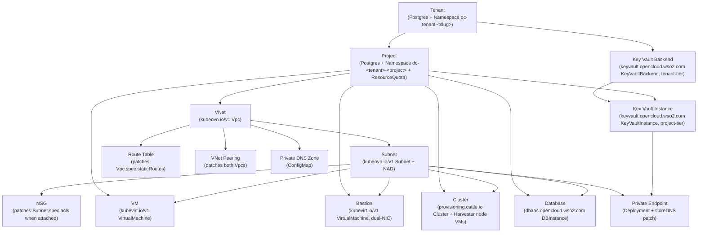

---

## 2. Provisioning model, at a glance

Three distinct provisioning models coexist. Knowing which one a resource follows tells
you how it fails, retries, and reports status.

```mermaid
flowchart TB
    subgraph M1["Model A: Shared periodic reconciler"]
        A1["VM, Bastion, Cluster"] --> A2["202 PENDING row"] --> A3["async goroutine kicks off create"] --> A4["internal/reconciler/reconciler.go\npolls every 60s, ALL pending rows,\nforever until ACTIVE/FAILED"]
    end
    subgraph M2["Model B: Per-request local poll"]
        B1["VNet, Subnet, Peering,\nDNS Zone, Private Endpoint"] --> B2["202 PENDING row"] --> B3["h.tasks.Go(...) goroutine:\ncreate, then poll ONCE\nuntil ready or timeout"] --> B4["goroutine exits — no further\nre-poll if it misses"]
    end
    subgraph M3["Model C: CRD create + live status read"]
        C1["Database, Key Vault"] --> C2["synchronous CR create call"] --> C3["status is read live off\nthe CRD on every GET\n(operator owns reconciliation)"]
    end
    subgraph M4["Model D: Synchronous, no CRD"]
        D1["Route Table, NSG"] --> D2["patches parent Vpc/Subnet\nfield, DB row ACTIVE immediately"]
    end
```

| Resource | Model | Backend object | Namespace/scope |
|---|---|---|---|
| VM | A | `kubevirt.io/v1 VirtualMachine` | project ns |
| Bastion | A | `kubevirt.io/v1 VirtualMachine` (dual-NIC) | project ns |
| Cluster | A | `provisioning.cattle.io Cluster` (+ Harvester node VMs) | `fleet-default` (Rancher) + project ns (nodes) |
| VNet | B | `kubeovn.io/v1 Vpc` | cluster-scoped |
| Subnet | B | `kubeovn.io/v1 Subnet` + NAD | cluster-scoped Subnet, NAD in project ns |
| VNet Peering | B | patches both `Vpc.spec.vpcPeerings/staticRoutes` | cluster-scoped |
| Private DNS Zone | B | `v1/ConfigMap` | project ns |
| Private Endpoint | B | `apps/v1 Deployment` + `ConfigMap` + CoreDNS patch | `dc-api-endpoints` + `kube-system` |
| Database | C | `dbaas.opencloud.wso2.com/v1alpha1 DBInstance` | project ns |
| Key Vault | C | `keyvault.opencloud.wso2.com/v1alpha1 KeyVaultBackend` + `KeyVaultInstance` | tenant ns + project ns |
| Route Table | D | none (patches `Vpc.spec.staticRoutes`) | — |
| NSG | D | none (patches `Subnet.spec.acls` on attach) | — |
| Tenant | D | `v1/Namespace` (best-effort) | tenant ns |
| Project | D-ish (async but best-effort) | `v1/Namespace` + `v1/ResourceQuota` | project ns |

---

## 3. Tenant

`internal/api/handlers/admin_tenants.go:90` `AdminTenantHandler.Create`

- Postgres row is authoritative; the only backend side effect is a best-effort
  `EnsureTenantNamespace` call.
- Creates `v1/Namespace "dc-tenant-<tenantSlug>"` (labels `dc-api/managed=true`,
  `dc-api.wso2.com/tenant*`) via `internal/providers/kubeovn/client.go:2413`.
- Synchronous; namespace failure does **not** roll back the tenant row.
- Root of the hierarchy — no dependencies.

```mermaid
sequenceDiagram
    participant C as Admin caller
    participant H as admin_tenants.go
    participant PG as Postgres
    participant KO as KubeOVN driver
    participant K8s as Harvester K8s API

    C->>H: POST /admin/tenants
    H->>PG: INSERT tenant row
    H->>KO: EnsureTenantNamespace(tenantSlug)
    KO->>K8s: CREATE Namespace "dc-tenant-{slug}"
    K8s-->>KO: ok (best-effort; errors logged, not fatal)
    H-->>C: 201 Created
```

---

## 4. Project

`internal/api/handlers/projects.go:168` `ProjectHandler.Create`

- Requires: Tenant (capacity check against tenant's project cap).
- Creates `v1/Namespace "dc-<tenant>-<project>"` + a `v1/ResourceQuota` mirroring the
  project's CPU/mem/storage/volume caps, via
  `internal/providers/kubeovn/client.go:2301` `EnsureProjectNamespace`.
- **Async, best-effort**: `h.tasks.Go(...)` goroutine, 2-minute timeout
  (`projects.go:233-241`); the project row returns to the caller immediately regardless
  of namespace-provisioning outcome. Every later resource in this project references
  this namespace via `internal/providers/common/namespace.go`.

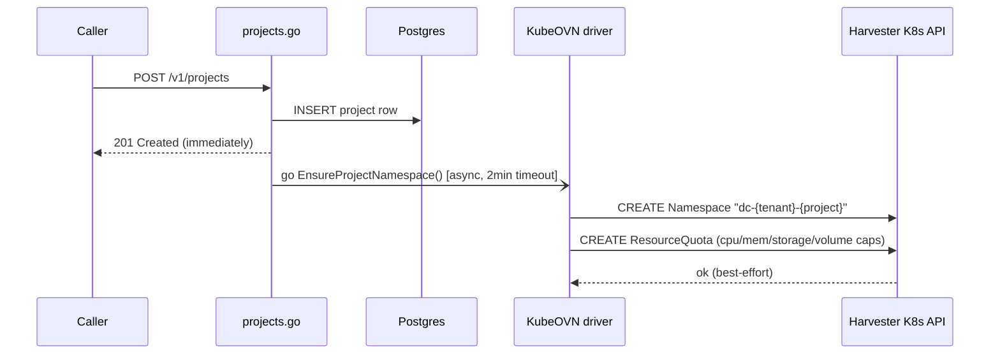

---

## 5. VNet

`internal/api/handlers/vnet.go:164` `VNetHandler.Create`

- Requires: Project (and its namespace).
- Creates `kubeovn.io/v1 Vpc` (cluster-scoped, generated name), seeded with
  `spec.namespaces = [dc-<tenant>-<project>]`.
  Driver: `internal/providers/kubeovn/client.go:381` `CreateVNet`.
- **Async + locally polled** (Model B): PENDING row → `h.tasks.Go` (`vnet.go:284-290`) →
  poll `GetVNet` → ACTIVE (`vnet.go:448-512`). This is a handler-local goroutine, **not**
  the shared reconciler.
- Parent for Subnet, Route Table, Peering, DNS Zone.

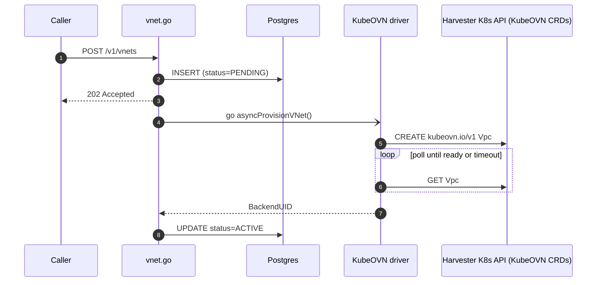

---

## 6. Subnet

`internal/api/handlers/subnet.go:121` `SubnetHandler.Create`

- **Requires VNet (Vpc) to exist first** — fetches the parent Vpc to derive
  tenant/project labels.
- Creates **two** objects, both named `subnetResourceName(vnetUID, name, tenant, project)`:
  1. `k8s.cni.cncf.io/v1 NetworkAttachmentDefinition` in the project namespace
     (created first — `client.go:557`)
  2. `kubeovn.io/v1 Subnet` (cluster-scoped, `spec.vpc=<parent Vpc>`,
     `spec.cidrBlock`, `spec.provider=<nad>.<ns>.ovn`) — created only **after**
     Harvester labels the NAD `network.harvesterhci.io/ready=true`
     (`waitForNADReady`, `client.go:1550`), otherwise Harvester's admission webhook
     rejects the Subnet.
  Driver: `internal/providers/kubeovn/client.go:494` `CreateSubnet`.
- **Async + locally polled** (Model B), same shape as VNet (`subnet.go:281-290`,
  `subnet.go:450-538`).
- Subnet is itself a prerequisite for VM/Bastion/Cluster/Database network attachment,
  NSG attach, Private Endpoint, and per-VPC DNS/NAT bootstrap.

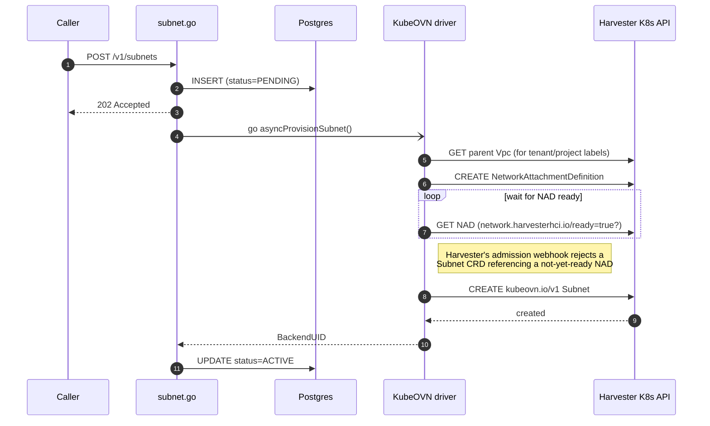

---

## 7. Route Table

`internal/api/handlers/route_table.go:162` `RouteTableHandler.Create`

- **No standalone CRD created.** `CreateRouteTable` is a no-op placeholder — the real
  effect is `UpdateRouteTableRoutes`, which server-side-applies (SSA) only the
  `spec.staticRoutes` field of the parent `Vpc`, tagging each route entry
  `routetable-<uuid>` (field manager `dc-api-kubeovn-staticroutes`).
  Driver: `internal/providers/kubeovn/client.go:922` (create no-op), `:966`
  (`UpdateRouteTableRoutes`), `:1001` (delete).
  `AssociateRouteTable`/`DisassociateRouteTable` (lines 1028, 1036) are pure DB-only
  no-ops — routes in this model apply VPC-wide, not per-subnet.
- Requires VNet to exist.
- **Synchronous** — DB row is `ACTIVE` the instant the handler returns
  (`route_table.go:231`); no PENDING/goroutine/poll at all.

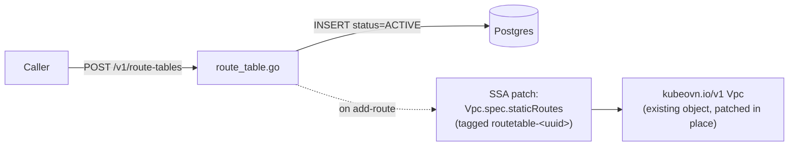

---

## 8. NSG (Network Security Group)

`internal/api/handlers/nsg.go:177` `NSGHandler.Create`

- **Creates nothing at create time** — `BackendUID=""`, DB status `ACTIVE` immediately
  (`internal/providers/kubeovn/client.go:1051-1061`).
- Rules only take effect once **attached** to a Subnet: `AttachNSGToSubnet`
  (`client.go:1122`) SSA-patches OVN ACL entries into the target
  `kubeovn.io/v1 Subnet.spec.acls`, tagged `nsg-<uuid>/<rule-name>` (field manager
  `dc-api-kubeovn-acls`). `UpdateNSGRules` (`:1080`) replaces the rule set on an
  already-attached NSG.
- Can be created standalone; Subnet must exist before an attach is meaningful.
- **Synchronous** at every step (create, attach, detach, rule update).

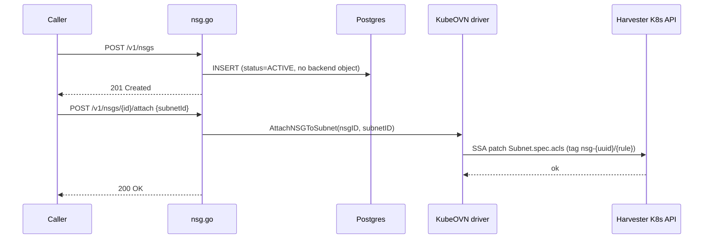

---

## 9. VNet Peering

`internal/api/handlers/peering.go:116` `PeeringHandler.Create`

- **Requires both VNets to exist and be ACTIVE** (`peering.go:150,188`).
- No new CRD — SSA-patches `spec.vpcPeerings` on **both** `Vpc` objects (field manager
  `dc-api-kubeovn-vpcpeerings`), and appends reciprocal `spec.staticRoutes` entries on
  both Vpcs (tag `peering-<name>`) using a transit `/24` CIDR — from a DB-backed pool,
  or a legacy SHA-256-derived CIDR for backward compatibility.
  Driver: `internal/providers/kubeovn/client.go:1191` `CreatePeering`
  (`appendVpcPeering` at `:1317`, `appendPeeringRoutes` at `:1637`).
- **Async wrapper around a synchronous call** (Model B, but resolves fast): PENDING row
  → `h.tasks.Go` (`peering.go:281-290`) wraps `CreatePeering`, which itself returns
  `StatusActive` immediately — "peering is synchronous now" (`client.go:1253`). The
  goroutine exists only to keep the HTTP response fast, not because there's a slow CRD
  to wait on.

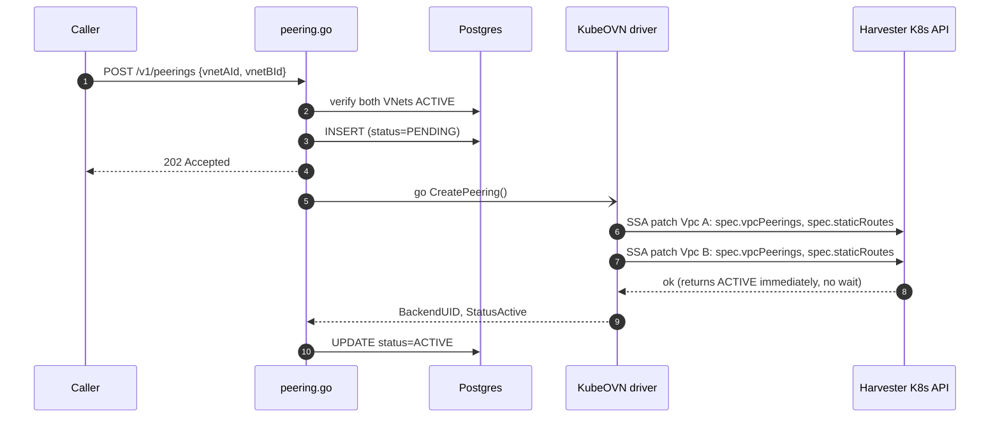

---

## 10. Private DNS Zone

`internal/api/handlers/dns_zone.go:180` `PrivateDnsZoneHandler.CreateZone`

- Requires: parent VNet to exist and be ACTIVE.
- Always uses the **ConfigMap path** (`createConfigMapDnsZone`): a `v1/ConfigMap` in the
  project namespace, one key per DNS record (keyed by dc-api record UUID). The legacy
  `kubeovn.io/v1 VpcDns` CRD path (`createVpcDnsZone`, `client.go:1761`) exists in code
  but is bypassed, because "the VpcDns CRD on KubeOVN v1.15 has no per-record API"
  (`client.go:1470-1477`).
  Driver: `internal/providers/kubeovn/client.go:1451` `CreatePrivateDnsZone`; record
  upsert/delete at `:1845`/`:1876`.
- **Async + locally polled** (Model B): PENDING row → `h.tasks.Go` → finalize to
  ACTIVE (`dns_zone.go:382-414`) — though the ConfigMap write is itself synchronous, so
  this resolves almost instantly.

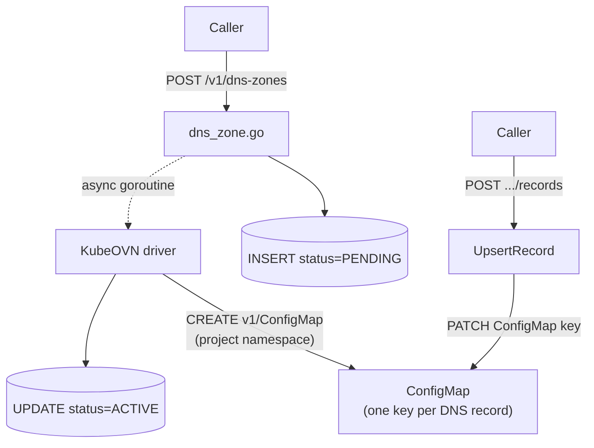

---

## 11. Private Endpoint

`internal/api/handlers/private_endpoint.go:135` `PrivateEndpointHandler.Create`

- **Requires** the target resource (e.g. a Key Vault) to exist, plus VNet + Subnet
  both ACTIVE, plus F20's per-VPC CoreDNS bootstrap to already exist (falls back to a
  warning-only skip if missing, `kubeovn_provisioner.go:652-658`). Target existence
  checked via `h.target.Exists`; backend address via a per-service `resolver.Resolve`.
- Creates, via `internal/providers/endpoints/kubeovn_provisioner.go`:
  1. `v1/Namespace "dc-api-endpoints"` (lazy bootstrap, shared across all tenants)
  2. `v1/ConfigMap` — nginx stream-proxy config
  3. `apps/v1 Deployment` — single nginx pod with **eth0 = cluster network** (Calico) and
     **net1 = Multus/KubeOVN NAD** into the tenant's subnet, IP pinned via the
     `ovn.kubernetes.io/ip_address` annotation (`ensureProxyDeployment`, `:489`)
  4. A PATCH to the per-VPC CoreDNS Corefile ConfigMap
     (`vpc-dns-corefile-<vpcUID>` in `kube-system`) adding a hosts-block A-record
     `<name>.<serviceClass>.dc.internal` (`regenerateVpcCorefile`, `:646`)
- **Async** (Model B): PENDING row inserted first — its UUID seeds the resource name
  used by the deployment/configmap — then provisioning runs in the background,
  flipping to ACTIVE once the proxy pod is Ready (`private_endpoint.go:227-298`).

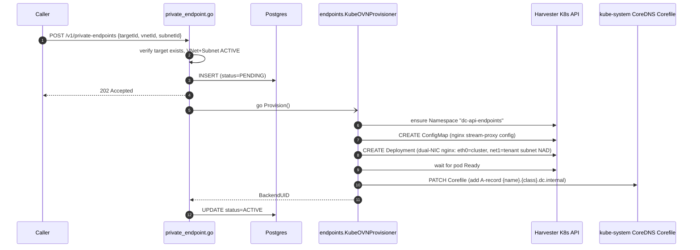

---

## 12. Database (DBaaS)

`internal/api/handlers/database.go:162` `DatabaseHandler.Create`

- Requires: Project namespace + a resolved network (VNet/Subnet → NAD, or a legacy
  pass-through NAD) via `h.resolveNetwork`.
- Creates a single **operator CRD**:
  `dbaas.opencloud.wso2.com/v1alpha1 DBInstance` in the project namespace
  `dc-<tenant>-<project>`, named `db-<8charUUID>`. Spec carries `dbInstanceClass`,
  `allocatedStorage`, `networkRef` (`"<namespace>/<NAD-name>"`), optional `osImage`
  (a Harvester `VirtualMachineImage` ref), and `dnsServerIP` (per-VPC CoreDNS pin for
  VPC-mode subnets).
  Driver: `internal/providers/dbaas/client.go:65` `CreateDatabaseInstance`; handler-side
  assembly at `database.go:285` `driveProvisioner`.
- **dc-api never creates the underlying VM itself** — a separate out-of-tree "dbaas"
  Kubernetes operator watches the `DBInstance` CR and provisions the
  Secret/DataVolumes/Service/ServiceMonitor and the actual KubeVirt
  `VirtualMachine` (running PostgreSQL) in response.
- **CR-create-then-poll** (Model C): the create call itself is a single synchronous
  API call (`database.go:270-278`); status thereafter is read **live off the CR** on
  every `GET` (mapped through an RDS-style phase table, `dbaas/client.go:125`) — dc-api
  has no background reconciler or goroutine for this resource; the operator owns
  convergence.

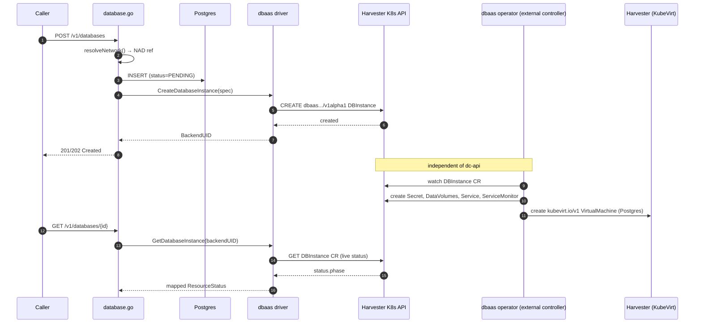

---

## 13. Key Vault

`internal/api/handlers/keyvault.go:122` `KeyVaultHandler.Create`

- **Two-tier CRD dependency**, both group `keyvault.opencloud.wso2.com/v1alpha1`:
  1. `KeyVaultBackend` — one per **tenant**, name `kvb-<tenantSlug>`, lives in the
     tenant namespace `dc-tenant-<tenantSlug>`. **Auto-ensured idempotently on every
     vault create** — `EnsureKeyVaultBackend` (`internal/providers/kvi/client.go:89`).
  2. `KeyVaultInstance` — one per **vault**, name `kv-<8charUUID>`, lives in the project
     namespace `dc-<tenant>-<project>`, `spec.backendRef` points at the Backend.
     `CreateKeyVaultInstance` (`kvi/client.go:164`).
- Orchestration: `keyvault.go:209` `driveKVI` — step 0 ensures the tenant namespace,
  step 1 ensures the Backend CR, step 2 creates the Instance CR.
- The KVI operator provisions the underlying **OpenBao StatefulSet + AppRole** in
  response to these CRs — dc-api doesn't create the StatefulSet directly.
- Secret CRUD (`keyvault_secrets.go`) is a **further, separate** runtime path: it
  proxies KV-v2 reads/writes to the OpenBao leader pod
  (`GetOpenBaoLeaderPod`), authenticated with a scoped token read from an
  operator-minted Kubernetes Secret — this is not a resource-create path, just I/O
  against an already-Ready vault.
- **CR-create-then-poll** (Model C), same shape as Database: `initialStatus=PENDING`
  only when a KVI provisioner is wired; `EnsureKeyVaultBackend`/
  `CreateKeyVaultInstance` are synchronous single calls; status is read live off the CR
  on `GET` (`kvi/client.go:197`) — no dc-api-side background reconciler.

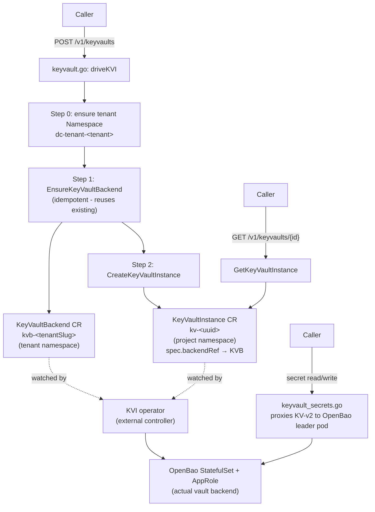

---

## 14. Non-resources / what's deliberately absent

- **Images & SSH keys** are not first-class resources. Images are a Harvester
  `VirtualMachineImage` CRD managed via `vm.go`'s `ListImages`/`CreateImage`
  (`internal/providers/harvester/client.go:799`, kind at `:817`). SSH keys are
  generated ephemerally per-VM/Bastion create (`generateSSHKeyPair()`), shown once in
  the response, and never persisted as their own resource.
- **No standalone Load Balancer, Public IP, Disk/Volume, Snapshot, or NAT Gateway
  resource** exists in dc-api today — VPC NAT is infra plumbing under `kube-system`,
  not a user-facing CRUD resource.

---

## 15. Cross-cutting reference

### Namespace convention (`internal/providers/common/namespace.go`)

| Scope | Namespace pattern | Used by |
|---|---|---|
| Tenant-tier | `dc-tenant-<tenantSlug>` | Tenant namespace, KeyVaultBackend |
| Project-tier | `dc-<tenant>-<project>` | VNet's NAD/Subnet objects, VM, Bastion, Cluster nodes, Database, KeyVaultInstance |
| Fixed system | `dc-api-endpoints` | Private Endpoint proxy deployments |
| Fixed system | `kube-system` | Per-VPC CoreDNS Corefile, VPC NAT gateway pods |
| Rancher-managed | `fleet-default` | `provisioning.cattle.io Cluster`, `HarvesterConfig` CRs |

### KubeOVN CRD group reference (`internal/providers/kubeovn/client.go:117-127`)

- `vpcs.kubeovn.io` — VNet
- `subnets.kubeovn.io` — Subnet
- `vpcdnses.kubeovn.io` — present but bypassed (DNS Zone uses ConfigMap instead)
- `ips.kubeovn.io` — read-only, used for phantom-IP detection
- `network-attachment-definitions.k8s.cni.cncf.io` — Subnet's NAD, VM/Bastion/Database
  network attachment
- **No standalone `vpc-peerings.kubeovn.io` CRD** — peering lives entirely as a field
  (`spec.vpcPeerings`) on the parent `Vpc`.

### Two independent status-sync mechanisms

- `internal/reconciler/reconciler.go` — the **only** shared, periodic (60s) reconciler;
  covers `ResourceTypeVM`, `ResourceTypeBastion`, `ResourceTypeCluster` only.
- Every other async resource (VNet, Subnet, Peering, DNS Zone, Private Endpoint) uses a
  **per-request, one-shot** `h.tasks.Go(...)` goroutine that polls once after create and
  then exits — there is no periodic re-poll if that goroutine's window is missed.
- Database and Key Vault use neither: status is read live off their CRD on every `GET`,
  with the external operator (dbaas operator / KVI operator) owning convergence.
