# Tenant Space & RKE2 Cluster Architecture

This document explains how a **tenant space** is built on Harvester/Rancher in this
repository, how authentication, access control and resource allocation work inside
it, how an **RKE2 cluster** is provisioned inside that tenant space, and how
networking behaves once the cluster is running.

It is a companion to [architecture.md](architecture.md) — that document covers the
full platform (all phases, all modules); this document zooms into **Phase 3
(Tenancy)** and explains the mechanics in depth, with diagrams.

Relevant modules:

- [`modules/tenancy/tenant-space`](../modules/tenancy/tenant-space) — tenant onboarding bundle
- [`modules/tenancy/vyos-tenant`](../modules/tenancy/vyos-tenant) — optional L3 gateway/VLAN provisioning on VyOS
- [`modules/tenancy/cluster-roles`](../modules/tenancy/cluster-roles) — custom Rancher role templates
- [`modules/tenancy/rbac`](../modules/tenancy/rbac) — lightweight bulk project/namespace creation (alternative to tenant-space)
- [`modules/tenancy/k8s-cluster`](../modules/tenancy/k8s-cluster) — provisions a tenant RKE2 cluster
- [`modules/tenancy/vm`](../modules/tenancy/vm) — provisions a standalone Harvester VM inside a tenant namespace
- [`modules/platform/networking`](../modules/platform/networking) — shared/platform-level VLAN networks

Background reading on the upstream products this is built on:
- Rancher: [Projects & Namespaces](https://ranchermanager.docs.rancher.com/pages-for-subheaders/manage-projects), [RBAC](https://ranchermanager.docs.rancher.com/pages-for-subheaders/manage-role-based-access-control-rbac), [RKE2 provisioning](https://ranchermanager.docs.rancher.com/pages-for-subheaders/use-existing-clusters)
- Harvester: [Networking](https://docs.harvesterhci.io/latest/networking/overview/), [Cloud Provider](https://docs.harvesterhci.io/latest/rancher/cloud-provider/), [VM Networking (Multus/NAD)](https://docs.harvesterhci.io/latest/networking/vlan/)

---

## 1. Mental model: what "tenant space" actually is

A tenant space is **not** a single resource — it's a bundle of Rancher/Harvester
primitives that together give one product team an isolated place to run VMs and/or
a Kubernetes cluster. The [`tenant-space`](../modules/tenancy/tenant-space) module
composes them in one `terraform apply`.

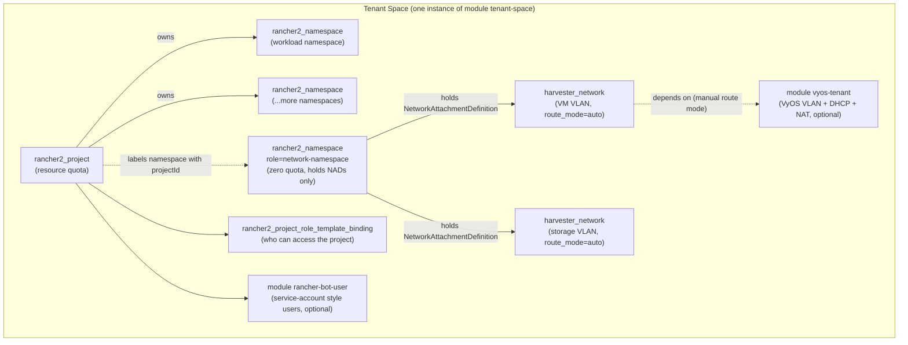

**Key files:** [`main.tf`](../modules/tenancy/tenant-space/main.tf),
[`variables.tf`](../modules/tenancy/tenant-space/variables.tf),
[`outputs.tf`](../modules/tenancy/tenant-space/outputs.tf)

### 1.1 The pieces, one at a time

| Component | Terraform resource | Purpose |
|---|---|---|
| **Project** | `rancher2_project.this` | The Rancher-native isolation boundary. Carries the resource quota (CPU/memory/storage) enforced across every namespace in it. |
| **Workload namespace(s)** | `rancher2_namespace.this` (one per entry in `var.namespaces`, or a single default one) | Where VMs, RKE2 machine-config secrets, and application workloads for this tenant live. Labelled `field.cattle.io/projectId` so Rancher (and the RKE2 cloud-provider auto-provisioner, see §4) know which project owns it. |
| **Network namespace** | `rancher2_namespace.network` | A *separate* namespace whose only job is to hold `NetworkAttachmentDefinition` objects (the VLAN networks below). It gets a **zero resource quota** (`limits_cpu=0`, `limits_memory=0Mi`, `requests_storage=0Gi`) specifically so nobody can accidentally schedule a VM into it — it's metadata-only. |
| **VM network** | `harvester_network.vm` / `harvester_network.tenant` | A Harvester `NetworkAttachmentDefinition` (Multus) tied to a VLAN ID, attached to the physical `ClusterNetwork` (default name `vm-network`). This is what tenant VMs/RKE2 nodes plug their primary NIC into. |
| **Storage network** | `harvester_network.storage` | A second, dedicated NAD on a different physical `ClusterNetwork` (default `strg-network`, mapped to a separate NIC such as `enp2s0`) so Longhorn replication traffic doesn't compete with tenant application traffic. |
| **VyOS tenant gateway** (optional) | `module.vyos_tenant` → [`vyos-tenant`](../modules/tenancy/vyos-tenant) | Only invoked when `vlan_id` is set **and** a VyOS endpoint is configured. Provisions the VLAN sub-interface, DHCP scope and NAT egress rule on the upstream VyOS router, giving the tenant VLAN real L3 routing/DHCP instead of Harvester's simple "auto" bridge mode. Marked experimental in [architecture.md](architecture.md). |
| **Role bindings** | `rancher2_project_role_template_binding.this` | Grants a user/group a role (built-in or one of the [custom roles](../modules/tenancy/cluster-roles/README.md)) scoped to this project only. |
| **Shared image access** | `rancher2_project_role_template_binding.shared_image_access` | Read-only binding into a separate `shared/images` project (defaults enabled) so every tenant can boot from the platform team's golden VM images without owning them. |
| **Bot users** | `module.bot_user` (→ `rancher-bot-user`) | Optional service-account-style Rancher users with API tokens, for CI/automation to manage this tenant's resources without a human login. |

### 1.2 IP addressing

When a VLAN ID is supplied, the tenant subnet is derived deterministically so tenants never collide:

```
tenant_subnet  = cidrsubnet("10.0.0.0/8", 15, max(vlan_id - 1000, 0))
tenant_gateway = cidrhost(tenant_subnet, 1)
```

This is the same math [`vyos-tenant`](../modules/tenancy/vyos-tenant/main.tf) uses for its DHCP scope, which is why VyOS-managed VLANs are restricted to the **1000–2999** range (`variables.tf` validation) — it keeps the /15 carve-up inside `10.0.0.0/8` from overlapping.

---

## 2. Authentication, access control & resource allocation

### 2.1 Authentication — who a "principal" is

Rancher (not the tenant-space module) owns authentication — it federates to whatever
auth provider is configured (local users, LDAP/AD, SAML/OIDC, GitHub, etc.). What
`tenant-space` and `k8s-cluster` consume is the **result** of that authentication: a
*principal ID*, in one of these forms:

| Field on `group_role_bindings` / `cluster_members` | Example | Meaning |
|---|---|---|
| `group_principal_id` | `local://group-abc123` | An external/local group |
| `user_principal_id` | `local://user-xyz789` | A specific Rancher user, by internal ID |
| `email` / `name` | `alice@example.com` | Looked up at apply-time via `rancher2_principal` (in `k8s-cluster`) |

Exactly one of these must be set per binding — both modules enforce this with a
validation rule/precondition, so a binding is never ambiguous about who it targets.

### 2.2 Authorization — RBAC layering

There are **two separate authorization layers** stacked on top of each other, and
it's important not to conflate them:

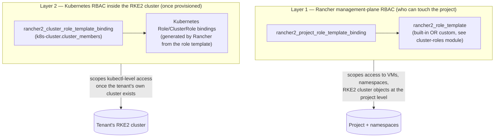

Layer 1 governs the Harvester/management cluster: can this user see or edit VMs,
namespaces, and machine configs that belong to the tenant project. Layer 2 (only
relevant once §4's RKE2 cluster exists) governs `kubectl` access *inside* that
tenant's own cluster.

### 2.3 Custom roles ([`cluster-roles`](../modules/tenancy/cluster-roles))

Rancher's built-in roles (`project-owner`, `project-member`, `cluster-member`, …)
are too coarse for a VM/RKE2-heavy platform (e.g. built-in `project-member`
inherits Kubernetes' `edit` ClusterRole, which would let a tenant read/clone
*any* VM image, including other tenants'). This repo defines ten purpose-built
role templates instead:

| Role | Context | Summary |
|---|---|---|
| `vm_manager` | project | Full VM lifecycle (create/power/console/migrate), datavolumes, keypairs, read-only images |
| `vm_operator` | project | View + power ops only, no create/delete |
| `vm_metrics_observer` | project | Read-only + metrics, for dashboards/monitoring users |
| `vm_creator` | cluster | Read-only cluster-wide images/keypairs (needed just to populate the VM-creation UI dropdowns) |
| `project_contributor` | project | Namespace + role-binding management within the project |
| `project_member_restricted` | project | Drop-in replacement for built-in `project-member` — explicit rule list so image cloning stays read-only |
| `network_manager` | **cluster** | Full CRUD on VLAN/NAD CRDs — intentionally cluster-scoped so **no tenant, even a project owner, can create or attach to a VLAN they don't already have access to** |
| `cluster_operator` | cluster | RKE2 cluster lifecycle ops (upgrade, etcd snapshots) without full admin |
| `cluster_reader` | cluster | Read-only cluster-wide view (mirrors built-in `cluster-member` minus project-create) |
| `cluster_contributor` | cluster | Full `*/*/*` — effectively cluster-admin at the Kubernetes API layer |

The important isolation guarantee: **VLAN/NetworkAttachmentDefinition creation is
cluster-scoped and reserved to `network_manager`.** A tenant granted even the most
generous project-level role cannot self-provision a new VLAN — networks are always
handed to them by the platform team via `tenant-space`'s `vlan_id`/`vm_network_vlan_id`
inputs. This is the main network-isolation control in this system (see §2.4).

### 2.4 What actually isolates one tenant from another

There is **no Kubernetes `NetworkPolicy` or Cilium `CiliumNetworkPolicy` anywhere
in this codebase.** Isolation is achieved by two orthogonal controls stacked
together, not by CNI-level policy enforcement:

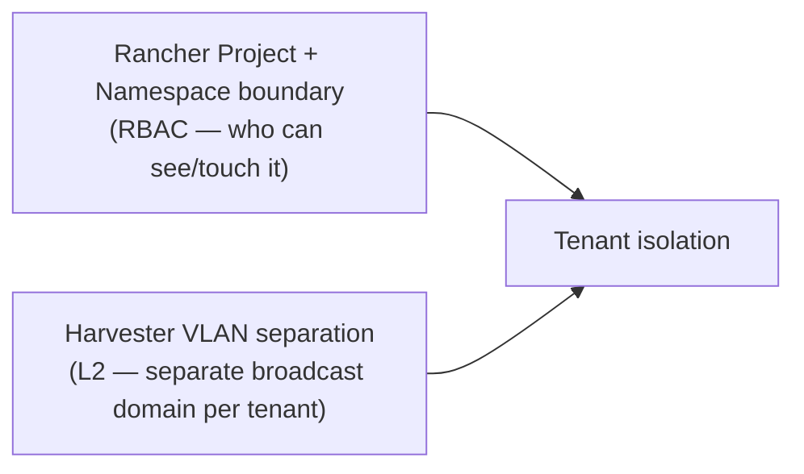

1. **RBAC isolation** — a user only sees the projects/namespaces they're bound to (§2.3).
2. **Network isolation** — each tenant's VMs/RKE2 nodes plug into their own VLAN
   (`harvester_network`), a separate L2 broadcast domain from every other tenant's
   VLAN. Cross-tenant traffic has to leave via the shared gateway/router, same as
   any other VLAN-segmented network.

If you need packet-level filtering *inside* a tenant's own RKE2 cluster (e.g.
namespace-to-namespace policy), that would have to be added at the CNI layer
(Cilium supports `CiliumNetworkPolicy`) — it is not currently configured by any
module here.

### 2.5 Resource allocation (quotas)

Quotas are **only applied if `cpu_limit` is set** — a tenant space can be created
quota-less (unbounded) if the platform team chooses not to pass quota variables.
When set, they apply at two levels simultaneously:

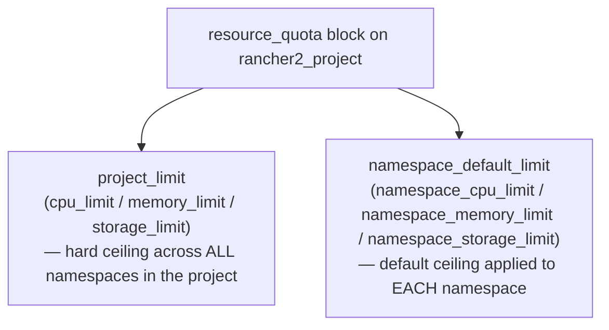

- `project_limit` is the project-wide cap (e.g. "this team gets 64 vCPU total").
- `namespace_default_limit` is what each individual namespace is capped at by
  default, so one greedy namespace can't consume the whole project quota.

Both must be internally consistent — a `precondition` in `main.tf` enforces that
if any quota variable is set, the required companion variables are also set, so
Terraform fails fast rather than Rancher silently rejecting a malformed quota.

The **network namespace** is the one deliberate exception: it always gets a
**zero** quota (`limits_cpu=0`, `limits_memory=0Mi`, `requests_storage=0Gi`)
regardless of the project's quota, because it must never host a workload — only
`NetworkAttachmentDefinition` metadata.

---

## 3. Putting it together: tenant space provisioning flow

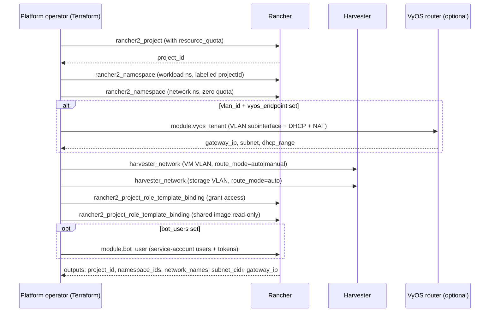

The module's outputs (`network_names`, a map of `vlan_id → "<namespace>/<name>"`,
plus `namespace_ids`) are exactly what the next stage — provisioning an RKE2
cluster — needs as inputs.

---

## 4. Provisioning an RKE2 cluster inside the tenant space

Once a tenant space exists, [`modules/tenancy/k8s-cluster`](../modules/tenancy/k8s-cluster)
provisions a dedicated RKE2 cluster whose VMs live inside that tenant's namespace/VLAN.
This gives the tenant a **hard** isolation boundary (their own Kubernetes API,
their own etcd) on top of the **soft** RBAC isolation from §2.

### 4.1 The linkage is by name, not by Terraform reference

There is no `tenant_id` variable on `k8s-cluster`. The two modules are connected
implicitly:

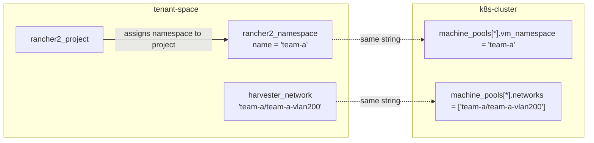

Because Rancher labels the namespace with `field.cattle.io/projectId` when it's
assigned to a project, an out-of-band controller — referred to in the code
comments as the **"namespace-credential-provisioner"** — watches for that label
and automatically creates a `harvesterconfig-<cluster-name>` Secret in
`fleet-default`. `k8s-cluster`'s `cloud_provider_config_secret` variable then
just references that secret by name (`secret://fleet-default:harvesterconfig-<name>`).

> ⚠️ **Ordering caveat**: since the connection is a shared string (namespace/network
> name), not a Terraform resource reference, there's no automatic `depends_on`
> between the two modules. [`modules/cloud/dc-controlplane`](../modules/cloud/dc-controlplane)
> is the one place in the repo that composes both in a single root module — if you
> do the same, add an explicit `depends_on = [module.tenant_space]` on the cluster
> module, or apply the tenant space first as a separate step.

### 4.2 Cluster provisioning flow

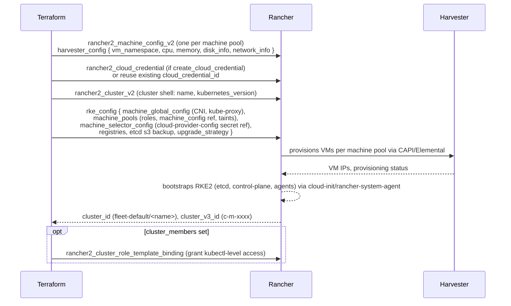

### 4.3 Machine pools = node groups

Each entry in `machine_pools` becomes one `rancher2_machine_config_v2` +
one `rke_config.machine_pools` block:

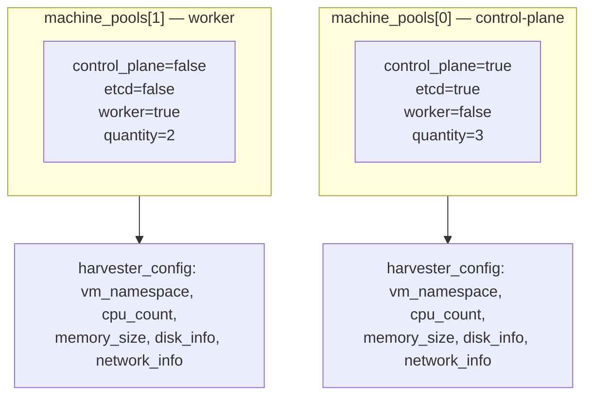

Node sizing, storage class, per-pool `user_data`/labels/taints are all set per
pool — so, e.g., control-plane nodes can use a different storage class or larger
disk than worker nodes.

### 4.4 The Harvester Cloud Provider connection

`enable_harvester_cloud_provider` (default true) wires the tenant cluster's CSI
driver and Service-type-LoadBalancer support back to the Harvester host cluster,
using the credential/secret chain from §4.1:

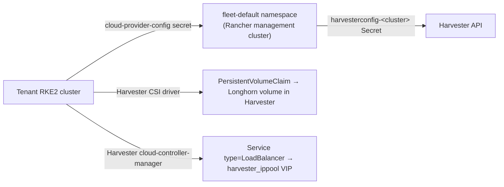

This is what lets a `PersistentVolumeClaim` inside the tenant's RKE2 cluster
become an actual Longhorn volume on the Harvester host, and what lets a
`Service` of `type: LoadBalancer` get a real IP from a Harvester `IPPool`
(see [Harvester Cloud Provider docs](https://docs.harvesterhci.io/latest/rancher/cloud-provider/)).

---

## 5. Networking inside the RKE2 cluster

There are two distinct networking layers once the cluster is running: the
**VM/node network** (how the RKE2 VMs plug into Harvester) and the **pod network**
(CNI, inside RKE2 itself).

### 5.1 Node-level network interfaces

Each RKE2 node VM can have up to three NICs, and **interface order matters** —
it's fixed as `[vm_network] + networks + [storage_network]`:

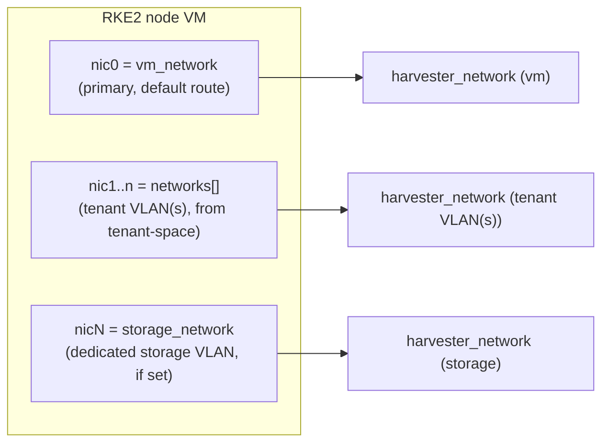

When `storage_network` is set, the generated cloud-init
([`node-cloud-init.tpl`](../modules/tenancy/k8s-cluster/templates/node-cloud-init.tpl))
writes a netplan file for that interface with `dhcp4-overrides: { use-routes: false,
route-metric: 500 }` — **this is what stops the storage NIC from stealing the
default route** away from the primary network. Without this, a node could
silently lose its route to the Rancher API/registry once the storage NIC came up.

### 5.2 Pod network — CNI

`machine_global_config.cni` defaults to **Cilium** (`var.cni = "cilium"` in
`k8s-cluster`, and hardcoded in `dc-controlplane`'s inline config too). RKE2
deploys the chosen CNI as its pod network automatically at bootstrap — no
separate module manages this. `disable-kube-proxy` defaults to `false`, meaning
Cilium runs alongside kube-proxy rather than replacing it (Cilium's
kube-proxy-replacement mode is not enabled here). See
[RKE2 CNI docs](https://docs.rke2.io/networking) and
[Cilium docs](https://docs.cilium.io/) if you want to change this.

### 5.3 Ingress

`ingress_controller` (default `ingress-nginx`, validated to be one of
`traefik|ingress-nginx|none`) is written into `machine_global_config` only
when it differs from RKE2's own default (`ingress-nginx`), i.e. only an explicit
override is emitted.

### 5.4 High availability for the control-plane API (dc-controlplane pattern)

This isn't part of `k8s-cluster` itself, but is worth understanding since it's
the concrete "3-node HA RKE2 cluster" example in this repo
([`modules/cloud/dc-controlplane`](../modules/cloud/dc-controlplane)):

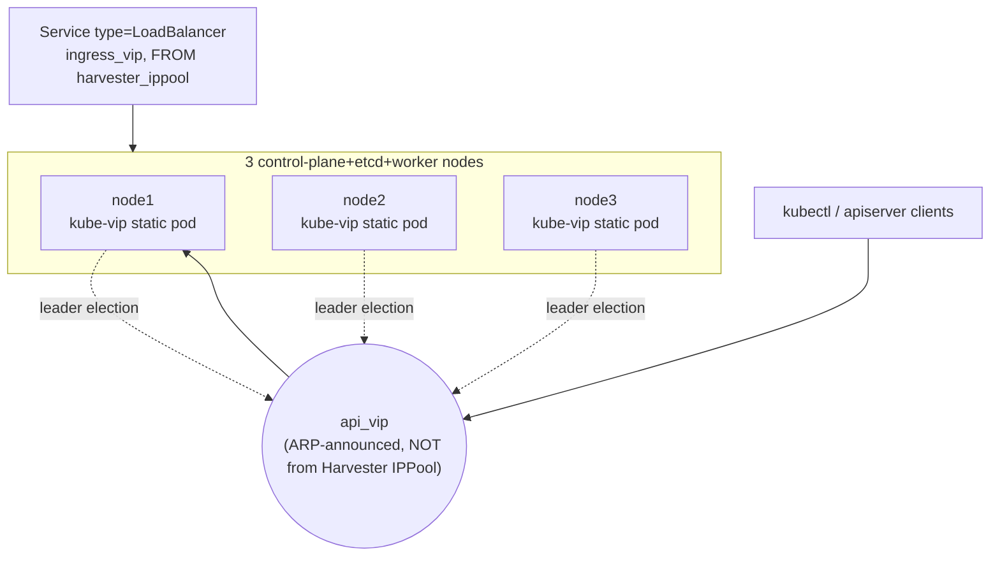

- **`api_vip`** (Kubernetes API HA) is handled by **kube-vip** as a static pod on
  every control-plane node — all three carry an identical manifest
  ([`kube-vip-rke2.yaml.tftpl`](../modules/cloud/dc-controlplane/templates/kube-vip-rke2.yaml.tftpl)),
  and kube-vip's own leader election decides which node ARPs the VIP at any moment.
  This VIP is deliberately **not** drawn from a Harvester `IPPool` — it's reserved
  out-of-band and ARP'd directly at L2.
- **`ingress_vip`** (application traffic / Service LoadBalancer) *is* drawn from a
  Harvester `harvester_ippool`, and is what the Harvester cloud-controller-manager
  (§4.4) hands out to `Service` objects of `type: LoadBalancer`.

This split — control-plane HA via kube-vip/ARP, application LB via Harvester
IPPool — is the HA pattern to replicate for any other multi-node tenant cluster
that needs the same guarantee.

---

## 6. End-to-end summary diagram

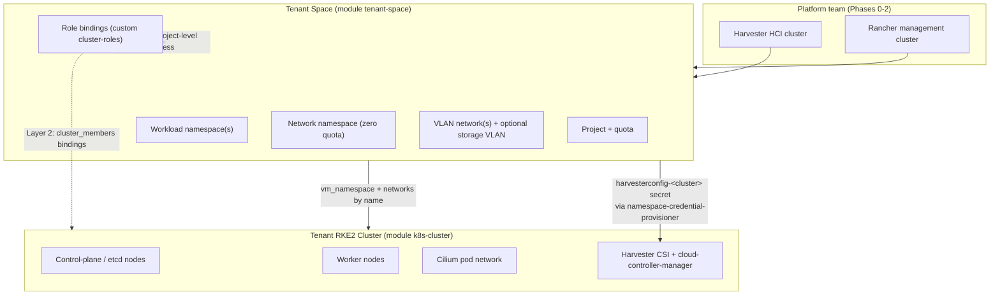

---

## 7. Quick reference: which module do I use?

| I want to... | Use |
|---|---|
| Give a team an isolated namespace/project with quotas, and optionally a VLAN | [`tenancy/tenant-space`](../modules/tenancy/tenant-space) |
| Bulk-create simple projects/namespaces without VLANs or role bindings | [`tenancy/rbac`](../modules/tenancy/rbac) |
| Give a tenant a dedicated Kubernetes cluster (hard isolation) | [`tenancy/k8s-cluster`](../modules/tenancy/k8s-cluster) (needs a tenant space's namespace/network first) |
| Give a tenant a single standalone VM (no Kubernetes) | [`tenancy/vm`](../modules/tenancy/vm) (needs a tenant space's namespace first) |
| Define/adjust who-can-do-what roles | [`tenancy/cluster-roles`](../modules/tenancy/cluster-roles) |
| Provision a real VLAN + DHCP + NAT on the physical router | [`tenancy/vyos-tenant`](../modules/tenancy/vyos-tenant) (called automatically by `tenant-space` when applicable — experimental) |
| Provision the platform's own shared VLANs (not tenant-specific) | [`platform/networking`](../modules/platform/networking) |
