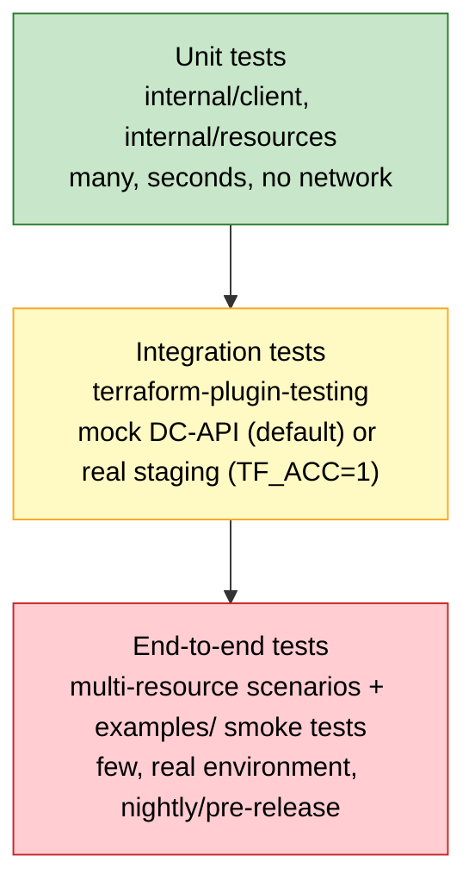
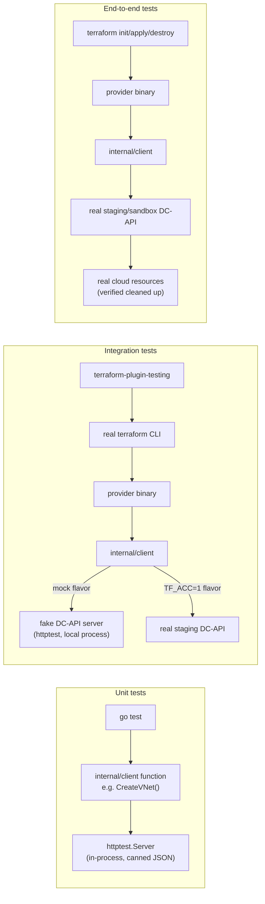
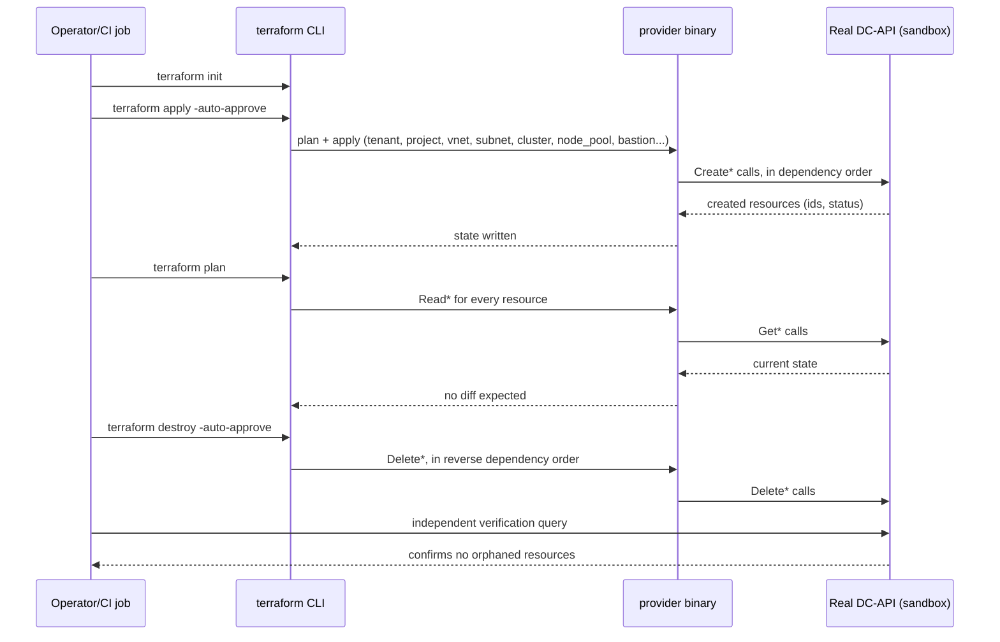

# Testing Plan — terraform-provider-dcapi

## Why this matters

Today the provider is validated by running `terraform apply` by hand against a real
DC-API environment. That works, but it doesn't scale and it doesn't catch regressions:

- Manual testing only exercises the paths you remember to click through. It's easy to
  forget to re-check `dcapi_vnet_peering` after touching shared code in
  [internal/client/client.go](../internal/client/client.go).
- There's no safety net for refactors. `doRequest` in `client.go` is called by every
  single resource and data source — a change there today has zero automated coverage.
- Bugs surface late (in a real tenant, sometimes with real cloud resources created)
  instead of in a fast local loop.
- Nothing currently proves that `terraform plan` is stable (no perpetual diffs) or that
  destroy actually cleans up, both of which are the most common ways real Terraform
  providers embarrass themselves.

The fix is the standard test pyramid, adapted to what a Terraform provider actually is:
a Go binary that translates HCL into HTTP calls against `internal/client`, plus schema
code in `internal/resources` / `internal/datasources` that maps Go structs to Terraform
state.

Higher up the pyramid = more realistic, but slower, flakier, and more expensive.
Lower down = fast and cheap, but only proves your code does what you told it to do,
not that the real API agrees. You need all three layers because each one catches a
different class of bug.

### Where each layer sits relative to the real DC-API

---

## Layer 1 — Unit testing

### What it means here

Plain `go test` on individual functions, with **no network calls and no Terraform
runtime involved**. This is the cheapest layer and should be the largest.

### What to target and why

1. **`internal/client/*.go` (e.g. [vnet.go](../internal/client/vnet.go),
   [vm.go](../internal/client/vm.go), [client.go](../internal/client/client.go))**
   - This package does all HTTP request/response handling, JSON marshaling, and error
     parsing (`apiErrorResponse`, `quotaErrorResponse`). This is exactly the kind of
     logic that silently breaks on refactor and is trivial to unit test.
   - Why: every resource and data source funnels through `doRequest`. A bug here (a
     wrong header, a mis-parsed error body, wrong status-code handling) breaks the
     entire provider at once. It's the single highest-leverage place to have coverage.
   - How: spin up an `httptest.Server` that returns canned JSON responses (success,
     404, 400 quota-exceeded, 500, malformed body) and assert the client method returns
     the right struct or the right typed error. No real DC-API needed.

2. **Schema/CRUD logic in `internal/resources/*.go` and `internal/datasources/*.go`**
   - Why: these files convert between Terraform's `ResourceData` and the client's Go
     structs (e.g. building request bodies from `d.Get(...)`, and populating state via
     `d.Set(...)` from an API response). Off-by-one bugs here (wrong field name, wrong
     type, forgetting to set an ID) are extremely common and cheap to catch without
     ever calling Terraform's plugin protocol.
   - How: call the `Create`/`Read`/`Update`/`Delete` functions directly with a
     `schema.ResourceData` built via `schema.TestResourceDataRaw(t, resourceSchema,
     rawConfigMap)`, and a mock/fake `*client.DCAPIClient` (see below) injected as
     `meta`. Assert on the resulting `ResourceData` state and on what request the fake
     client recorded.
   - Also unit-test any ID-encoding/decoding helpers (state IDs encode paths like
     `t/p/vnet_uuid/subnet_uuid` per the comment in
     [provider.go](../internal/provider/provider.go)) — parsing these wrong is a classic
     source of "resource not found on refresh" bugs.

3. **A fake/mock DC-API client**
   - Introduce a small interface (e.g. `type API interface { CreateVNet(...)... }`)
     that `*client.DCAPIClient` satisfies, or keep using `httptest.Server` per-package.
     Either approach lets resource-level unit tests run without real HTTP or a real
     backend.
   - Why: this is what makes layer-2 (below) unnecessary for every single code path —
     most CRUD logic can be proven correct here, fast, in CI, without any environment.

### How to implement

- Standard Go tooling: `go test ./...`, table-driven tests, `httptest.Server` for HTTP
  fakes, `testify/assert` or `testify/require` if you want less boilerplate (currently
  not a dependency — adding it is optional, stdlib `testing` is enough).
- Target: every exported function in `internal/client` has at least a happy-path and
  an error-path test. Every resource's `Create`/`Read`/`Update`/`Delete` has a
  happy-path test.
- Run in CI on every PR — these are fast (seconds) and require no secrets or external
  services, so there's no excuse not to run them on every commit.

### Test case catalog — Layer 1

**`internal/client` (repeat this shape for every method in every file: `vnet.go`,
`subnet.go`, `vm.go`, `cluster.go`, `node_pool.go`, `bastion.go`, `tenant.go`,
`project.go`, `service_account.go`, `nsg.go`, `route_table.go`, `key_vault.go`,
`key_vault_secret.go`, `dns_record.go`, `private_dns_zone.go`, `private_endpoint.go`,
`vnet_peering.go`, `tenant_member.go`, `region.go`, `image.go`):

| # | Test case | Why it matters |
|---|---|---|
| 1 | Successful `Create*` returns a populated struct with ID set | Baseline happy path every resource depends on |
| 2 | Successful `Get*`/`Read*` unmarshals all fields correctly | Catches silent field-mapping typos |
| 3 | Successful `Update*` sends the right HTTP method/body and parses the response | PATCH/PUT mismatches are a common source of "update does nothing" bugs |
| 4 | Successful `Delete*` treats 200/202/204 as success | Some resources may return different success codes on delete |
| 5 | 404 on `Get*` is surfaced as a distinguishable "not found" (not a generic error) | Resource `Read` functions rely on this to trigger drift-detection/removal from state |
| 6 | 400 with `quotaErrorResponse` body is parsed into cap/allocated/available/requested detail | This is bespoke parsing logic (`quotaErrorResponse`) with no coverage today |
| 7 | 400/409 with plain `apiErrorResponse` body surfaces the `Error` string, not raw JSON | Determines whether the user sees a readable Terraform diagnostic |
| 8 | 500 / non-JSON error body doesn't panic and returns a wrapped error | Defensive — malformed server responses shouldn't crash `terraform apply` |
| 9 | Request includes auth header/token and correct `baseURL` path join (leading/trailing slash handling) | `NewClient` trims trailing slash; path-building bugs are easy to introduce silently |
| 10 | Context cancellation/timeout during `doRequest` returns promptly with a context error | Terraform can cancel operations (Ctrl-C); this must not hang |

**`internal/resources` and `internal/datasources` (repeat per resource/data source):**

| # | Test case | Why it matters |
|---|---|---|
| 1 | `Create` builds the correct request body from `ResourceData` (all fields, including optional/computed ones) | Off-by-one/typo'd field names are the most common CRUD bug |
| 2 | `Create` sets the resource ID in state on success | Missing `d.SetId(...)` breaks the resource permanently |
| 3 | `Read` populates all schema attributes from the API response via `d.Set(...)` | Silent `d.Set` errors are ignored by default — assert the returned diagnostics/error |
| 4 | `Read` on a 404/not-found result removes the resource from state (`d.SetId("")`) rather than erroring | Required for `terraform refresh`/`plan` to behave correctly when something is deleted out-of-band |
| 5 | `Update` only sends fields that actually changed (`d.HasChange(...)`) where the API expects partial updates | Prevents accidentally clobbering unrelated fields |
| 6 | `Delete` calls the client with the ID parsed from state, and clears state on success | |
| 7 | ID-encoding/decoding helpers round-trip correctly (e.g. `t/p/vnet_uuid/subnet_uuid`) | Directly called out as the state-ID convention in `provider.go`; a parsing bug breaks every subsequent `Read`/`Delete` |
| 8 | ID-decoding rejects a malformed ID with a clear error instead of an index-out-of-range panic | Malformed state (hand-edited, or from an old provider version) shouldn't crash Terraform |
| 9 | Schema-level validation functions (if any field has custom `ValidateFunc`) reject invalid input | Cheap to test, catches typos in validation logic itself |
| 10 | Data source `Read` maps API response into the data-source schema and sets a deterministic ID | Data sources are read-only but still need correct field mapping |

---

## Layer 2 — Integration testing (Terraform Plugin Testing framework)

### What it means here

HashiCorp publishes a purpose-built framework for this exact layer:
`terraform-plugin-testing` (the SDKv2-compatible successor to the old
`resource.Test`/`helper/resource` acceptance test helpers your `terraform-plugin-sdk/v2`
dependency already ships alongside). It actually runs the Terraform CLI against your
provider binary, applying real HCL configs, and asserts on real state — but you control
what's on the other end of the HTTP calls.

### Why this layer exists (why unit tests aren't enough)

Unit tests prove "my Go function does what I told it to do." They do **not** prove:

- That the schema you defined actually round-trips through Terraform's plan/apply/
  refresh/destroy lifecycle without perpetual diffs (a very common real bug: a field
  that Terraform thinks changed every plan because of type mismatches, unset defaults,
  or missing `DiffSuppressFunc`).
- That `terraform import` works and produces the same state as `apply`.
- That resource dependencies (e.g. `dcapi_subnet` depending on `dcapi_vnet`,
  `dcapi_route_table_association` depending on both a route table and a subnet) are
  wired correctly end-to-end through actual HCL, not just through hand-built
  `ResourceData`.
- That your data sources ([internal/datasources](../internal/datasources)) return data
  Terraform can actually reference elsewhere in a config.

This is the layer "acceptance tests" occupy in the Terraform provider ecosystem, and
it's the layer every official HashiCorp provider guide centers its testing story on.

### Two flavors — pick based on cost/risk

**A. Integration tests against a mock/local DC-API (recommended default — see the
dedicated [Mock Testing Strategy](#mock-testing-strategy-can-and-should-we-mock)
section below)**

- Stand up a lightweight fake DC-API server (a small Go `net/http` server, or a
  recorded-response replay server) that implements just enough of the real API's
  behavior to make resource lifecycles work realistically (create returns an id,
  get returns what you created, delete succeeds, etc.).
- Point `dcapi_endpoint`/`DCAPI_ENDPOINT` at this fake server and run real
  `terraform-plugin-testing` test cases (`resource.Test(t, resource.TestCase{...})`)
  using the actual `.tf` configs (you already have realistic ones per resource under
  [examples/](../examples/) — these are excellent seeds for test `Config` strings).
- Why this is the right default: it's fast, runs in CI with no cloud credentials or
  cost, and is deterministic (no flaky real infra). It still exercises the entire
  Terraform plugin protocol path (schema validation, plan diffing, apply, refresh,
  destroy) that unit tests skip.

**B. Integration tests against a real (non-prod) DC-API environment**

- Same `terraform-plugin-testing` test cases, but pointed at a real staging DC-API
  instance/tenant reserved for CI.
- Why you still want some of these: the fake server can only be as correct as your
  understanding of the real API. A handful of these tests (not all of them) catch
  drift between your assumptions and DC-API's actual behavior — e.g. real quota
  errors, real async provisioning delays, real field validation on the server side.
- Gate these behind `TF_ACC=1` (the standard convention `terraform-plugin-testing`
  already respects to skip acceptance tests unless explicitly enabled) and real
  credentials in CI secrets, and run them less frequently (e.g. nightly or on merge to
  main) rather than on every PR, since they're slower and depend on external
  infrastructure health.

### What to cover per resource

For each of the ~19 resources (tenant, project, vnet, subnet, virtual_machine,
service_account, bastion, cluster, node_pool, route_table,
route_table_association, network_security_group, nsg_attachment, key_vault,
key_vault_secret, dns_record, private_dns_zone, private_endpoint, vnet_peering) and
each data source:

1. **Create + Read** — apply a minimal valid config, assert state matches.
2. **Plan-after-apply is empty** (no perpetual diff) — the single most common
   Terraform provider bug class.
3. **Update** — change an updatable field, assert an in-place update happens (not an
   unwanted destroy/recreate) unless recreate is actually correct.
4. **Import** — `terraform import` the resource, assert state matches a fresh apply.
5. **Destroy** — assert clean teardown, and that a subsequent `Read` correctly reports
   "not found" rather than erroring.
6. **Dependent-resource ordering** — for resources that reference others (subnet→vnet,
   nsg_attachment→nsg, route_table_association→route_table+subnet, node_pool→cluster),
   confirm Terraform's dependency graph applies/destroys in the right order.
7. **Error paths** — invalid config values are rejected at `plan` time where possible
   (schema validation), and API-level errors (quota exceeded, 404, conflict) surface as
   readable Terraform diagnostics, not raw JSON or panics.

### How to implement

- Add `github.com/hashicorp/terraform-plugin-testing` as a dependency.
- One `_test.go` file per resource under `internal/resources/`, following the standard
  `resource.Test(t, resource.TestCase{ProviderFactories: ..., Steps: []resource.TestStep{...}})`
  pattern.
- Reuse the HCL already written in `examples/<resource>/main.tf` as the seed for test
  `Config:` strings — this also keeps your examples honest (if a test based on the
  example config fails, the example itself is wrong or stale).
- Wire the mock-server flavor into CI (GitHub Actions or whatever CI you adopt) to run
  on every PR; wire the real-environment flavor to run on a schedule/on merge to main
  behind `TF_ACC=1`.

### Test case catalog — Layer 2

Apply this template to **every** resource (`dcapi_tenant`, `dcapi_project`,
`dcapi_vnet`, `dcapi_subnet`, `dcapi_virtual_machine`, `dcapi_service_account`,
`dcapi_bastion`, `dcapi_cluster`, `dcapi_node_pool`, `dcapi_route_table`,
`dcapi_route_table_association`, `dcapi_network_security_group`,
`dcapi_nsg_attachment`, `dcapi_key_vault`, `dcapi_key_vault_secret`,
`dcapi_dns_record`, `dcapi_private_dns_zone`, `dcapi_private_endpoint`,
`dcapi_vnet_peering`, `dcapi_tenant_member`) and every data source:

| # | Test case | Notes |
|---|---|---|
| 1 | `apply` with a minimal valid config succeeds and state matches config | Core happy path |
| 2 | Second `plan` immediately after `apply` shows no changes | Catches perpetual-diff bugs — run this for every resource, no exceptions |
| 3 | `apply` with all optional fields populated succeeds and state matches | Exercises the full schema, not just required fields |
| 4 | Changing an updatable attribute and re-applying performs an in-place update | Confirms `Update` is wired and no unwanted `ForceNew` |
| 5 | Changing a `ForceNew` attribute triggers destroy+recreate (and is expected to) | Confirms `ForceNew` is set correctly, not missing or over-applied |
| 6 | `terraform import <addr> <id>` followed by `plan` shows no diff | Import path is a common gap — it uses a separate code path from `Create` |
| 7 | `terraform destroy` removes the resource; a subsequent out-of-band `Read` (via the fake/real API) confirms it's gone | Validates `Delete` actually deletes, not a no-op |
| 8 | Manually deleting the resource on the backend, then `terraform plan`, shows the resource will be recreated (not an error/crash) | Validates the 404-in-`Read` → `d.SetId("")` drift-detection path |
| 9 | Invalid config (wrong type, missing required field) fails at `terraform validate`/`plan`, before any API call | Schema validation should catch this without a network round trip |
| 10 | A config referencing another resource's output/attribute (e.g. `dcapi_subnet` using `dcapi_vnet.this.id`) applies with correct dependency ordering | Confirms wiring between resources, not just standalone schema correctness |
| 11 | Destroying resources with dependents in reverse dependency order succeeds (e.g. destroy `dcapi_subnet` before its `dcapi_vnet`) | Confirms the provider doesn't need extra `depends_on` hints to get ordering right |
| 12 | API returns a quota-exceeded (400) or conflict (409) error mid-apply — Terraform surfaces a readable diagnostic and doesn't leave state inconsistent | Confirms `internal/client` error parsing surfaces correctly through the whole plugin stack, not just in isolation |

Resource-specific additions worth calling out explicitly:

| Resource(s) | Extra test case | Why |
|---|---|---|
| `dcapi_subnet`, `dcapi_route_table_association`, `dcapi_nsg_attachment`, `dcapi_node_pool`, `dcapi_vnet_peering` | Referential integrity: applying with a reference to a nonexistent parent resource ID fails cleanly | These resources embed another resource's ID in their path/body |
| `dcapi_virtual_machine`, `dcapi_cluster`, `dcapi_bastion`, `dcapi_node_pool` | Long-running/async create: the fake server can simulate a "pending → ready" polling sequence so the provider's wait-for-ready logic (if any) is exercised | These are the resources most likely to have provisioning-status polling |
| `dcapi_key_vault_secret` | Sensitive value is marked `Sensitive` in schema and never appears in plan output/logs | Secret-handling correctness, easy to regress silently |
| `dcapi_tenant_member`, `dcapi_service_account` | Permission/role field changes trigger the correct update call (not delete+recreate) if the API supports in-place role change | Avoids unnecessarily disruptive applies for a role tweak |
| Data sources (`dcapi_vnet`, `dcapi_subnet`, `dcapi_region`, etc.) | Data source output is usable as an input to a resource in the same `plan` | Confirms real interpolation works, not just that `Read` populates a standalone data structure |

---

## Mock Testing Strategy — can (and should) we mock?

**Short answer: yes.** Mocking is not just possible here, it's the recommended default
for layer 1 and the recommended default flavor of layer 2 — it should be treated as a
first-class part of this plan, not an optional extra.

### Why mocking works well for this codebase specifically

- All backend communication is already funneled through one narrow seam:
  `DCAPIClient.doRequest` in [internal/client/client.go](../internal/client/client.go).
  Every resource/data source goes through this single chokepoint, which means there is
  exactly one place that needs a fake counterpart for the whole provider to be
  testable without real infrastructure.
- `NewClient(baseURL, token)` takes a plain `baseURL` string — there's no hidden
  service discovery, SDK, or hardcoded endpoint. Pointing it at
  `httptest.NewServer(...).URL` instead of the real DC-API requires no code changes to
  `internal/client`, only a different `baseURL` at test setup time.
- The `examples/` directory already has realistic, resource-specific HCL for every
  resource type, which doubles as ready-made test fixtures/config for mock-backed
  integration tests — no need to invent new configs from scratch.

### Two mocking techniques, both applicable here

1. **`httptest.Server` per test (unit + integration layer)** — a real, local
   `net/http` server started in-process for the duration of one test, returning
   whatever canned response that test needs. Simplest option, zero new dependencies,
   works for both layer 1 (testing one client method) and layer 2 (pointing the whole
   provider at it via `DCAPI_ENDPOINT`).
2. **A small stateful fake DC-API service (integration layer)** — instead of returning
   one canned response, a fake server that keeps an in-memory map of created
   resources and actually implements create/get/update/delete/list semantics
   (including returning 404 after delete). This is what makes multi-step
   `terraform-plugin-testing` scenarios (apply → plan-no-diff → update → import →
   destroy) realistic without touching the real DC-API. This is worth building once,
   as a shared internal test helper package (e.g. `internal/testutil/fakedcapi`), and
   reusing it across every resource's integration tests.

### What mocking can't tell you (so it doesn't replace layers 2B/3)

- Whether your understanding of the real DC-API's behavior is actually correct
  (status codes, async timing, real quota limits, real validation rules). A mock only
  encodes what you already believe to be true — if that belief is wrong, the mock
  will happily confirm the wrong behavior.
- Real network/auth/TLS conditions, real latency, real eventual consistency.

This is exactly why the plan keeps layer 2B (`TF_ACC=1` against real staging) and
layer 3 (end-to-end against real infrastructure) — mocking accelerates and cheapens
almost all of the test matrix, but a deliberately small slice still needs the real
backend to catch drift between the mock and reality.

### Concrete additions to this plan

- Add `internal/testutil/fakedcapi` (or similar): a small package providing a
  stateful in-memory fake implementing the DC-API surface, started via
  `httptest.NewServer`, with helpers to seed/inspect its state from a test.
- Use it as the default backend for **all** layer-1 client tests and **all** layer-2
  "mock flavor" integration tests described above.
- Keep it in the main module (not a separate repo/tool) so it evolves alongside
  `internal/client` — when a new client method is added, its fake counterpart is added
  in the same PR.
- Explicitly document in the repo (e.g. in this file and in a short `CONTRIBUTING`
  note) that `go test ./...` without `TF_ACC=1` never touches a real network, so
  contributors and CI runners can rely on that guarantee.

---

## Layer 3 — End-to-end testing

### What it means here

Full, realistic Terraform workflows run against the **actual provider binary** and, for
at least a subset, the **actual DC-API** (or as close to production topology as you can
afford), covering multi-resource configurations the way a real user would write them —
not one resource in isolation.

### Why you need this on top of layer 2

Integration tests (layer 2) still test resources somewhat in isolation, with tightly
scoped configs. End-to-end tests answer questions like:

- Does a full "spin up a tenant → project → vnet → subnet → cluster → node pool →
  bastion" config, spanning most of the resource types, actually apply cleanly in one
  shot in dependency order, and destroy cleanly in reverse order?
- Does state survive realistic operator behavior: `plan`, `apply`, edit config,
  `plan`/`apply` again, `refresh`, `destroy`? (Not just a single apply/destroy cycle.)
- Do the real examples you ship in [examples/](../examples/) actually work, unedited,
  against a real environment? (These are your provider's documentation — if they're
  broken, every new user's first experience is broken.)
- Are there interaction bugs between resources that only show up with real DC-API
  timing/eventual-consistency behavior (e.g. a VM created before its VNet has finished
  provisioning on the real backend, something a mock server won't naturally reproduce)?

### How to implement

1. **Example-config smoke tests**: a CI job (scheduled, e.g. nightly, or manual trigger
   given cost) that runs `terraform init && terraform validate && terraform apply
   -auto-approve && terraform destroy -auto-approve` against each directory under
   `examples/`, using a real (non-prod/sandbox) DC-API tenant and short-lived
   credentials. Catches drift between docs/examples and actual behavior directly.
2. **Composite scenario tests**: hand-written `.tf` configs (living under something
   like `test/e2e/` — you already have a `test/main.tf` that could be a starting point)
   that combine many resource types the way a real customer would, run through the same
   full lifecycle. Keep the count small (a handful of realistic scenarios, not one per
   resource — that's what layer 2 is for) since these are the slowest and most
   expensive tests you have.
3. **Real cleanup verification**: after `destroy`, independently query the real DC-API
   (or the cloud provider underneath it, if DC-API delegates to Azure/etc.) to confirm
   no orphaned resources remain — this is the check most likely to be skipped in manual
   testing today and the one most likely to cost real money if it's silently broken.
4. **Manual exploratory testing still has a place here**: keep doing what you do today,
   but treat it as covering the "did this feel right, does the error message make
   sense, are there UX rough edges" class of feedback — not as the only safety net for
   "does this resource still work."

### Test case catalog — Layer 3

| # | Test case | Why |
|---|---|---|
| 1 | `terraform init && validate && apply && destroy` succeeds unedited for every directory under `examples/` | Proves the shipped documentation actually works |
| 2 | Composite scenario: `tenant → project → vnet → subnet → cluster → node_pool → bastion` applies in one pass with correct ordering | Exercises the realistic dependency graph a real customer would build |
| 3 | Composite scenario: `vnet → subnet → vm` plus `nsg` + `nsg_attachment` plus `route_table` + `route_table_association` applies cleanly | Covers the networking-heavy resource cluster together, where ordering bugs are most likely |
| 4 | Composite scenario: `key_vault` + `key_vault_secret` + `private_endpoint` + `private_dns_zone` + `dns_record` applies cleanly | Covers the secrets/DNS resource cluster together |
| 5 | Edit a live composite config (add one resource, change one field) and re-`apply` — only the intended diff applies | Simulates real iterative usage, not just one-shot apply/destroy |
| 6 | `terraform refresh` after an out-of-band change on the real backend correctly updates state | Confirms drift detection works against the real API, not just the mock |
| 7 | Full `destroy` of a composite scenario, followed by an independent query against the real DC-API (and, if applicable, the underlying cloud provider) confirming zero orphaned resources | Directly prevents silent resource/cost leaks — the highest-value E2E check |
| 8 | Destroying out of the "natural" order (e.g. user runs `terraform destroy -target=...` on a leaf resource first) still succeeds or fails with a clear error | Real users don't always destroy cleanly top-down |
| 9 | Re-running the full example smoke suite twice in a row on a shared sandbox tenant doesn't collide (naming, quota) | Confirms test fixtures are safe to run repeatedly/concurrently in CI |
| 10 | A scenario that intentionally exceeds a real quota produces a clear, actionable Terraform error (not a crash or an opaque failure) | Validates the full error path from real API → `internal/client` → Terraform diagnostic, using a real quota response instead of a synthetic one |

### Composite scenario lifecycle (sequence)

### Cadence

- Run on a schedule (e.g. nightly) and before cutting a release, not on every PR — these
  are slow, cost real cloud resources, and depend on external system health.
- Treat a failure here as high priority regardless of cause: even if the root cause is
  "DC-API changed behavior," your provider needs to adapt, so these failures are
  never "not your bug."

---

## Suggested rollout order

Given there is currently zero automated testing, don't try to build all three layers
at once. A practical order:

1. **Start with unit tests for `internal/client`** — highest leverage, lowest effort,
   no test infrastructure required. This alone will catch a large class of regressions.
2. **Add unit tests for 2-3 representative resources** (pick one simple one like
   `dcapi_project`, one with dependent-resource complexity like
   `dcapi_route_table_association`, one with async/long-running behavior like
   `dcapi_virtual_machine` or `dcapi_cluster`) to establish the pattern, then fill in
   the rest.
3. **Stand up the mock-server integration test harness** (`internal/testutil/fakedcapi`,
   see [Mock Testing Strategy](#mock-testing-strategy-can-and-should-we-mock)) and get
   one resource's full lifecycle (create/read/plan-stability/update/import/destroy)
   passing end-to-end through `terraform-plugin-testing`. Then replicate per resource.
4. **Wire both of the above into CI** (even a minimal GitHub Actions workflow — there
   is currently none in this repo) so regressions are caught automatically instead of
   relying on remembering to test manually.
5. **Add the real-environment acceptance tests** behind `TF_ACC=1`, starting with the
   resources most likely to drift from mock assumptions (anything with async
   provisioning: cluster, node_pool, vm, bastion).
6. **Add the end-to-end example-smoke-test job last** — it's the most valuable
   confidence check before a release, but also the most expensive, so it's fine for it
   to come after the cheaper layers are already catching most bugs.

---

## Summary table

| Layer | Scope | Speed | Mocked? | Needs real DC-API? | Runs |
|---|---|---|---|---|---|
| Unit | Single function (client method, CRUD handler, ID parsing) | Seconds | Yes — `httptest.Server` | No | Every commit/PR |
| Integration (mock) | Full resource lifecycle via real Terraform CLI, fake backend | Seconds–minutes | Yes — `internal/testutil/fakedcapi` | No | Every PR |
| Integration (real, `TF_ACC=1`) | Full resource lifecycle, real backend | Minutes | No | Yes (staging) | Nightly / merge to main |
| End-to-end | Multi-resource realistic configs + example configs, real backend | Minutes–tens of minutes | No | Yes (staging) | Nightly / pre-release |
| Manual exploratory | UX, error message quality, new/ambiguous scenarios | N/A | No | Yes | Ad hoc, as today |

Mocking (see [Mock Testing Strategy](#mock-testing-strategy-can-and-should-we-mock))
covers the two fastest, cheapest rows above — that's roughly the whole day-to-day
CI signal on every PR, with zero real-environment dependency.
