# 00 — Test Suite at a Glance

This page shows the whole test suite in diagrams. Each section links to the document with the
details. The diagrams use Mermaid, which GitHub renders. In VS Code, use a Markdown preview
extension with Mermaid support.

## 1. The big picture

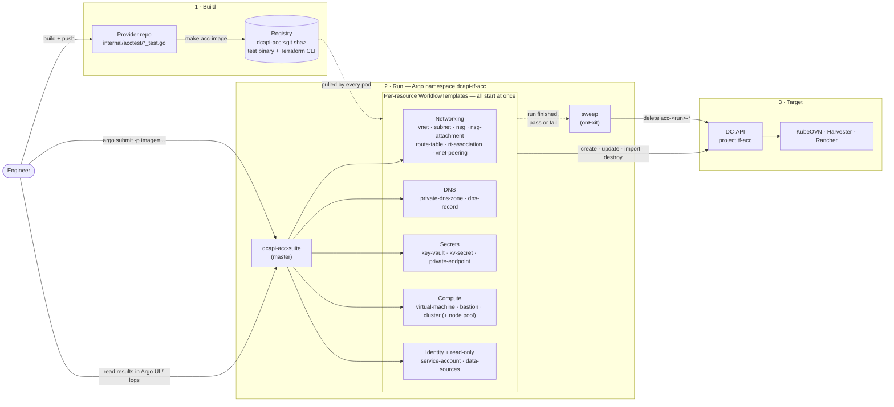

- The **Go tests** decide what is tested and whether it passed ([03](03-acceptance-test-framework.md)).
- **Argo** only starts one pod per resource, in parallel, and cleans up at the end ([05](05-argo-workflows.md)).
- There are no schedules and no test tiers. Someone starts a run, and it runs everything.

## 2. The two kinds of Argo template

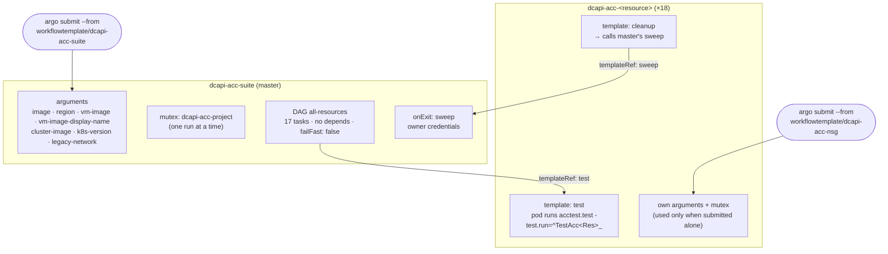

When the master calls a resource template, only its `test` template is used. The resource
template's own arguments, mutex and cleanup apply only when it's submitted on its own.
`dcapi-acc-node-pool` runs the same test as `dcapi-acc-cluster`, so the master leaves it out
([05 §3–4](05-argo-workflows.md#3-a-per-resource-template)).

## 3. Inside one test pod

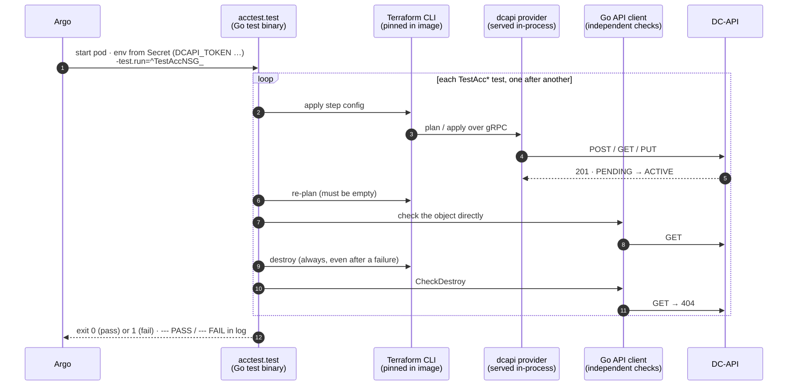

## 4. What one resource's test checks

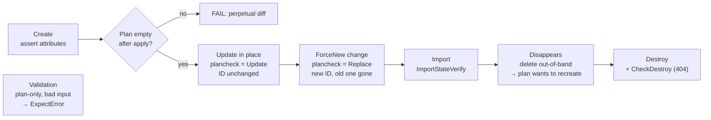

Steps that don't apply to a resource are left out. The coverage matrix says which ones each
resource gets ([01 §6](01-scope-and-strategy.md#6-coverage-matrix-what-every-resource-gets)).
Validation tests create nothing and run in seconds.

## 5. What each resource's tests create

Every test builds its own parents and destroys them. Nothing is shared between tests or
resources ([04](04-test-isolation.md)).

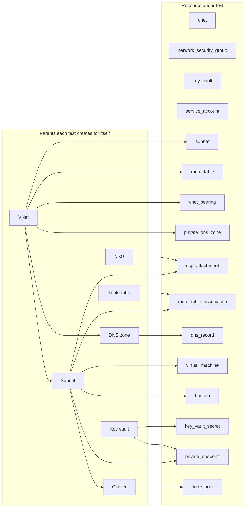

`vnet`, `network_security_group`, `key_vault` and `service_account` need no parent. The cluster
and node pool are tested together as one chained test
([resources/cluster.md](resources/cluster.md#why-cluster-and-node-pool-are-one-chained-test)).

### Address ranges

Each resource has its own range, so parallel resources never overlap. Tests inside a resource run
one after another and reuse it ([04 §2](04-test-isolation.md#2-cidr-plan)).

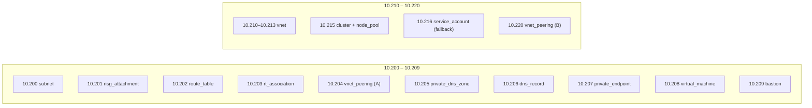

## 6. A full run over time

All resources start together. The run lasts as long as the slowest one. These are estimates
until the first real run ([05 §3.3](05-argo-workflows.md#33-values-per-resource)).

```mermaid
gantt
    title One dcapi-acc-suite run (estimated upper bounds)
    dateFormat HH:mm
    axisFormat %H:%M
    section Fast
    data-sources            :00:00, 2m
    nsg                     :00:00, 6m
    service-account         :00:00, 8m
    section Networking
    vnet                    :00:00, 25m
    subnet                  :00:00, 60m
    nsg-attachment          :00:00, 60m
    route-table             :00:00, 30m
    rt-association          :00:00, 60m
    vnet-peering            :00:00, 40m
    section DNS and secrets
    private-dns-zone        :00:00, 20m
    dns-record              :00:00, 35m
    key-vault               :00:00, 20m
    kv-secret               :00:00, 25m
    private-endpoint        :00:00, 45m
    section Compute
    virtual-machine         :00:00, 70m
    bastion                 :00:00, 75m
    cluster + node pool     :crit, cl, 00:00, 90m
    section Exit
    sweep                   :after cl, 5m
```

Many of the long bars come from deleting the last subnet in a VNet, which can take up to 15
minutes ([04 §3](04-test-isolation.md#3-the-last-subnet-delete)).

## 7. Credentials

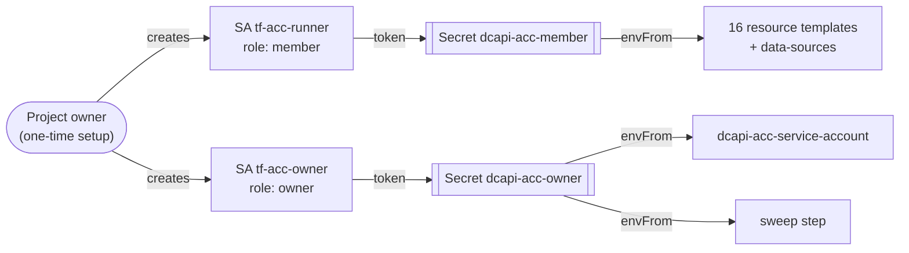

Tokens reach pods only through `envFrom`, never as Argo parameters. The `member` SA running
nearly everything also proves `member` is enough to manage resources
([02](02-authentication-and-test-environment.md)).

## 8. Cleanup

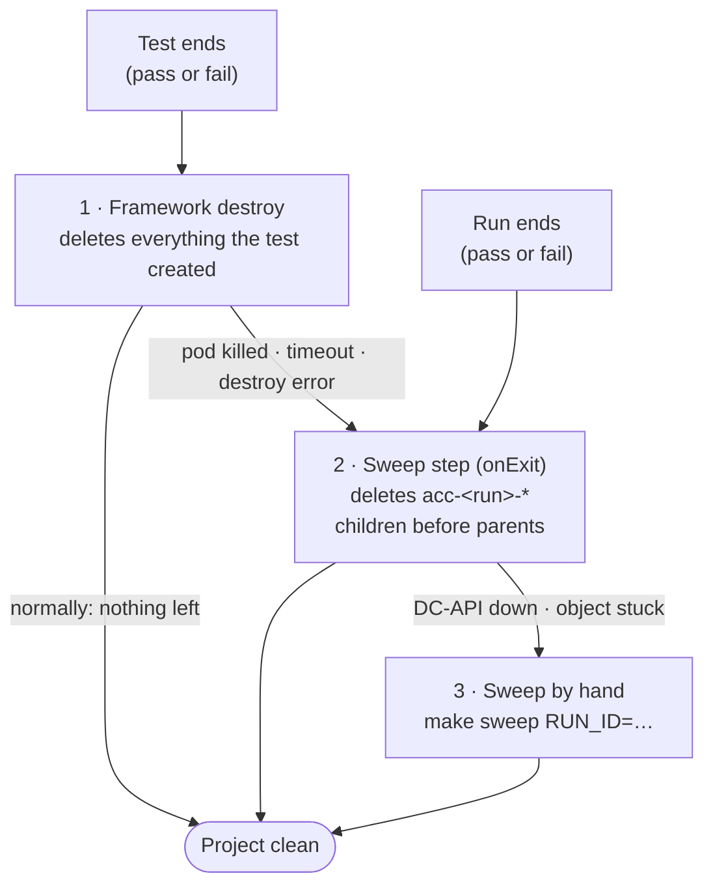

The sweep only matches `acc-<this run>-` names, so it can't touch the runner SAs or another
run's objects ([06](06-cleanup.md)).

## 9. Reading a failed run

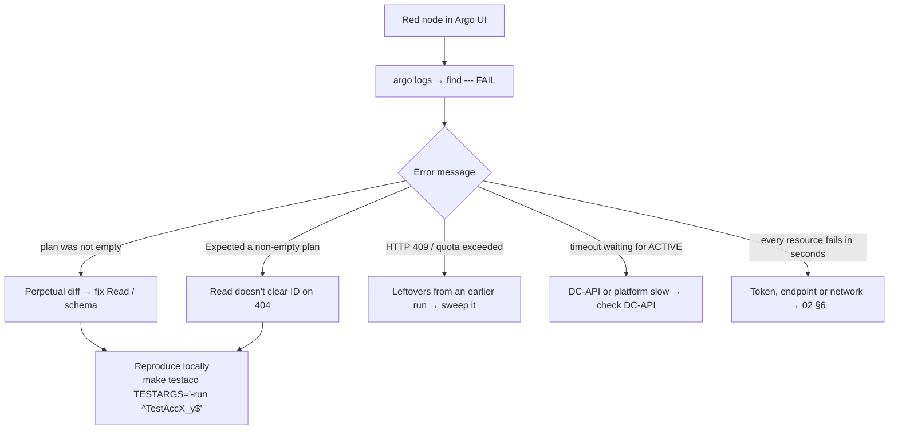

Details: [05 §7](05-argo-workflows.md#7-reading-the-results).

## 10. Rollout

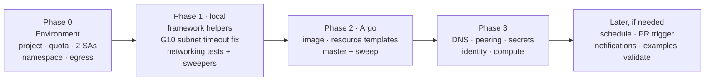

Details: [08](08-rollout-plan.md).
