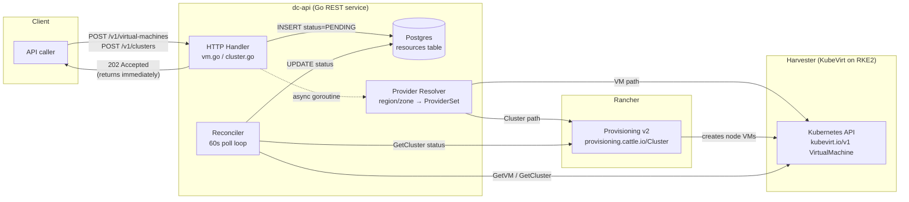
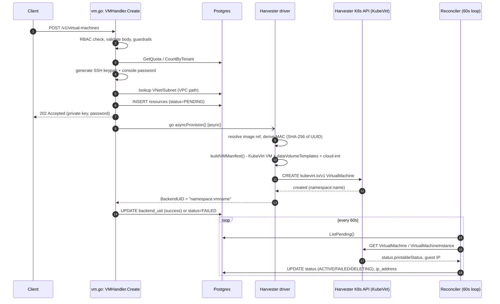
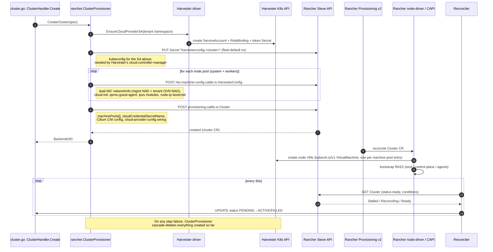
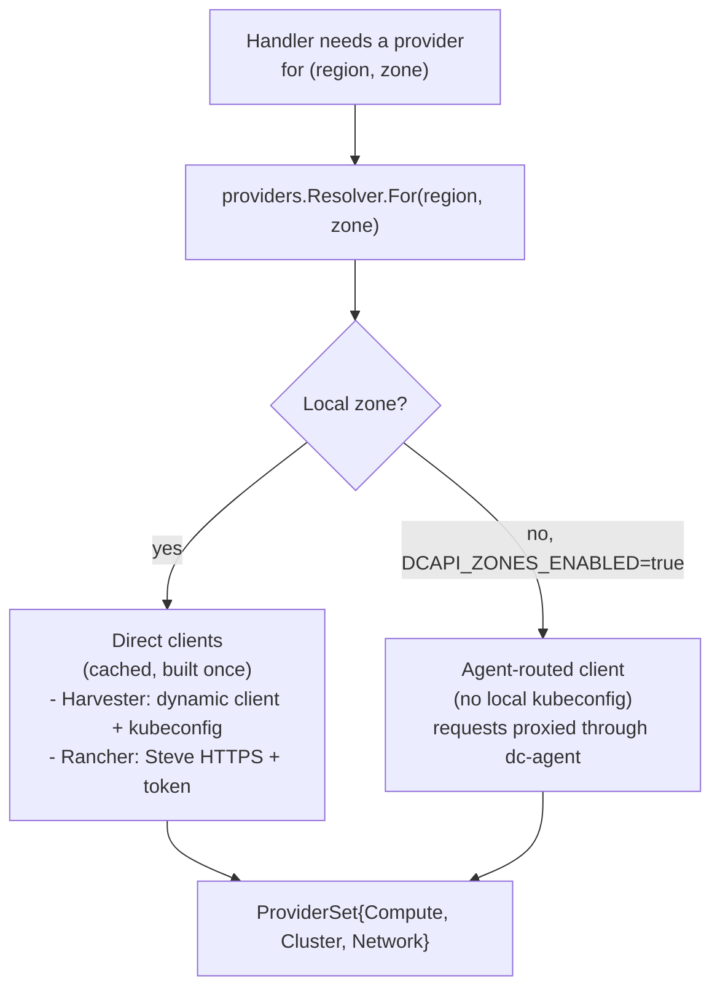

# Creation Flow: dc-api → Harvester → Rancher

This document traces exactly what happens under the hood when a client calls dc-api to
create a **virtual machine** or a **Kubernetes cluster**, down to the Harvester (KubeVirt)
and Rancher (Provisioning v2) layers.

It is based on the current Go implementation in `dc-api/internal/api/handlers/`,
`dc-api/internal/providers/harvester/`, and `dc-api/internal/providers/rancher/`.

> **Note on other docs in this folder:** [`tenant-space-and-rke2-architecture.md`](tenant-space-and-rke2-architecture.md)
> describes a Terraform-module based design (`modules/tenancy/...`). No such Terraform
> modules exist in this repository — the real system is the Go REST service described
> below, which talks to Harvester and Rancher directly via Kubernetes/Steve APIs, with no
> Terraform in the request path. Treat that doc as conceptual/historical, not as the
> current implementation. [`dc-api-architecture.md`](dc-api-architecture.md) §7.3 also has
> a simplified cluster-creation sequence diagram; the diagram in this doc supersedes it
> with the actual multi-step flow.

---

## 1. High-level picture

Two distinct creation flows exist, sharing the same handler pattern but diverging at the
provider layer:

- **VM creation** → dc-api talks to **Harvester only** (KubeVirt CRDs via a Kubernetes
  dynamic client).
- **Cluster creation** → dc-api talks to **Rancher** (Provisioning v2 via the Steve REST
  API), and Rancher in turn provisions the cluster's node VMs *in* Harvester on dc-api's
  behalf.

---

## 2. VM creation: `POST /v1/virtual-machines`

Handler: `dc-api/internal/api/handlers/vm.go` (`VMHandler.Create`, line ~229)

### Steps

1. **Auth/RBAC** — JWT already validated by middleware; handler checks
   `rbac.ActionVMWrite` for the tenant/project.
2. **Validate request** — decode `CreateVMRequest`; either the legacy `network_name`
   bridge field or the VPC `vnet_id` + `subnet_id` pair must be set (XOR).
3. **Guardrails** — reject VM creation on infra-reserved Network Attachment
   Definitions (NADs).
4. **Quota check** — against Postgres (`GetQuota`, `CountByTenant`) *before* touching
   Harvester, so failed quota checks never leak infra resources.
5. **Credential generation** — dc-api generates an ECDSA P-256 SSH keypair and a
   console password itself; the private key is returned to the caller once and never
   persisted.
6. **VPC resolution (if applicable)** — look up the VNet/Subnet rows in Postgres,
   confirm `ACTIVE`, and resolve their `BackendUID`s (the underlying KubeOVN
   `Vpc`/`Subnet` CRD names) plus region/zone.
7. **Provider resolution** — `providers.Resolver.For(region, zone)` picks the
   Harvester client for that zone (direct dynamic client for the local zone, or a
   `dc-agent`-routed client for a remote zone in multi-region mode).
8. **Persist PENDING row** — `resources` table gets a new row with
   `status = PENDING` before any external call is made.
9. **Respond `202 Accepted`** immediately, including the private key and console
   password — the actual provisioning happens asynchronously.
10. **Async goroutine** (`asyncProvision`) calls `compute.CreateVM(...)` → this is
    where Harvester is actually hit (see §3).
11. On success, the row's `backend_uid` is updated; on failure, `status = FAILED`.
12. **Reconciler** (`internal/reconciler/reconciler.go`) polls Harvester every 60s for
    all PENDING resources and syncs `PENDING → ACTIVE/FAILED/DELETING` plus the
    assigned IP address into Postgres.

### Sequence diagram

### Harvester driver internals

File: `dc-api/internal/providers/harvester/client.go`

- No Harvester REST SDK is used — Harvester VMs are plain **Kubernetes CRDs**, accessed
  via `k8s.io/client-go/dynamic` against a kubeconfig
  (`DCAPI_HARVESTER_KUBECONFIG`, base64-encoded).
- Key GVRs touched:
  - `kubevirt.io/v1 VirtualMachine` — create/get/delete (the VM itself)
  - `kubevirt.io/v1 VirtualMachineInstance` — read-only, used to read the guest IP via
    the qemu-guest-agent
  - `harvesterhci.io/v1beta1 VirtualMachineImage` — the OS image the VM clones from
  - `k8s.cni.cncf.io/v1 NetworkAttachmentDefinition` — Multus NAD = the VM's network
  - core `Namespace`, `ServiceAccount`, `RoleBinding`, `Secret` — cloud-provider SA
    bootstrap (consumed later by Rancher/Harvester's cloud-controller-manager)
- `CreateVM` builds a KubeVirt `VirtualMachine` manifest with a `dataVolumeTemplates`
  entry (Harvester auto-clones the source `VirtualMachineImage` into a new disk),
  cloud-init `userData` injecting the SSH public key, console password, and
  qemu-guest-agent, and a network attachment referencing the resolved NAD (VPC/OVN,
  legacy bridge, or dual-NIC for bastion mode).
- **`BackendUID` format**: `"<namespace>:<vmname>"`, where
  `namespace = dc-<tenantID>-<projectID>`. This namespace must already exist —
  created earlier by the project handler (`EnsureProjectNamespace`), not by `CreateVM`
  itself.
- Status mapping: KubeVirt's `status.printableStatus` → dc-api's `ResourceStatus`
  (`Running → ACTIVE`, `Terminating → DELETING`,
  `CrashLoopBackOff`/similar → `FAILED`, anything else → `PENDING`).

---

## 3. Cluster creation: `POST /v1/clusters`

Handler: `dc-api/internal/api/handlers/cluster.go` (`ClusterHandler.Create`, line ~338)

Follows the same request shape as VM creation (RBAC → quota → VPC lookup → PENDING row
→ `202 Accepted` → async provision → reconciler), but resolves a **`ClusterProvider`
(Rancher)** instead of Harvester directly. This is the one flow where
**dc-api → Rancher → Harvester** is a real two-hop chain.

### Rancher driver internals

Files: `dc-api/internal/providers/rancher/client.go`, `cluster.go`, `steve.go`

- Uses Rancher's **Provisioning v2 API** (`provisioning.cattle.io`, objects live in the
  `fleet-default` namespace) over the **Steve REST API** — plain HTTPS, bearer token
  auth. Explicitly *not* the `rancher2` Terraform provider, and not the legacy `/v3/clusters`
  API (that's used only for one thing: kubeconfig generation, see below).
- Auth: `DCAPI_RANCHER_URL` + `DCAPI_RANCHER_TOKEN`, sent as
  `Authorization: Bearer <token>` on every call (`client.go: do()`).
- `CreateCluster` has two code paths:
  - **Legacy bridge path** (`NetworkName` set): simple single-NIC
    `HarvesterConfig` + `Cluster` CR, no cloud-provider SA bootstrap.
  - **VPC path** (`VNetBackendUID` + `SubnetBackendUID` set) — the interesting one:

- **Cloud credential**: cluster creation references a *pre-existing* Harvester cloud
  credential secret in Rancher (`DCAPI_RANCHER_HARVESTER_CREDENTIAL`) — a one-time
  manual setup step done via Rancher UI (Cluster Management → Cloud Credentials →
  Harvester), not created per-request.
- **Kubeconfig retrieval** (`GetKubeconfig`) is a two-step call: GET the provisioning
  `Cluster` to read `status.clusterName` (the *management* cluster ID, `c-m-xxxxx`),
  then `POST /v3/clusters/<id>?action=generateKubeconfig` — the one place the legacy
  v3 API is still used.
- **Status mapping**: `status.ready` / `status.conditions` (`Stalled`, `Reconciling`)
  → dc-api's `PENDING`/`ACTIVE`/`FAILED`.
- **Node pool lifecycle** (`AddNodePool` / `ScaleNodePool` / `RemoveNodePool` /
  `UpdateNodePoolTaintsLabels`) all do GET-then-PUT on the `Cluster` CR via Steve, with
  409-conflict retry.

---

## 4. Provider selection (region/zone routing)

- `internal/providers/factory.go` builds concrete drivers by config
  (`DCAPI_VM_PROVIDER=harvester`, `DCAPI_CLUSTER_PROVIDER=rancher`,
  `DCAPI_NETWORK_PROVIDER=kubeovn`).
- `internal/providers/registry.go` is what handlers actually call per-request:
  `Resolver.For(region, zone) → *ProviderSet{Compute, Cluster, Network}`.
- The local zone's clients are eager-built and cached. A remote zone (multi-region
  mode) builds credential-free clients lazily that route every operation through
  `dc-agent` instead of holding a kubeconfig directly.
- **Rancher's `ClusterProvider` is global** — there is one Rancher control plane
  shared across all zones; there's no per-zone Rancher client the way there is for
  Harvester/KubeOVN.

---

## 5. Objects created, by layer

| Resource | Created by | API group / kind |
|---|---|---|
| VM | Harvester driver | `kubevirt.io/v1 VirtualMachine` |
| VM disk image | Harvester driver | `harvesterhci.io/v1beta1 VirtualMachineImage` |
| VM network | Harvester driver (reads existing) | `k8s.cni.cncf.io/v1 NetworkAttachmentDefinition` |
| Cloud-provider SA plumbing | Harvester driver | core `ServiceAccount`, `RoleBinding`, `Secret` |
| RKE2 cluster | Rancher driver (Steve) | `provisioning.cattle.io Cluster` (`fleet-default` ns) |
| Node machine config | Rancher driver (Steve) | `rke-machine-config.cattle.io HarvesterConfig` |
| Cloud-provider config secret | Rancher driver (Steve) | core `Secret` (`harvesterconfig-<cluster>`) |
| Cluster's node VMs | Rancher (via its own Harvester node-driver/CAPI) | `kubevirt.io/v1 VirtualMachine` |
| VPC / Subnet (M2 network layer) | KubeOVN driver | `kubeovn.io Vpc` / `Subnet` |

---

## 6. Auth/config summary

All configured via env vars in `dc-api/internal/config/config.go` (`DCAPI_` prefix):

| Concern | Env var(s) |
|---|---|
| Harvester kubeconfig | `DCAPI_HARVESTER_KUBECONFIG` (base64; ignored when zones are enabled) |
| Harvester default namespace | `DCAPI_HARVESTER_NAMESPACE` |
| Rancher endpoint/token | `DCAPI_RANCHER_URL`, `DCAPI_RANCHER_TOKEN` |
| Rancher TLS (dev only) | `DCAPI_RANCHER_INSECURE` |
| Harvester cloud credential (pre-created in Rancher UI) | `DCAPI_RANCHER_HARVESTER_CREDENTIAL` |
| Cluster networking | `DCAPI_CLUSTER_MGMT_NAD`, `DCAPI_CLUSTER_VM_NAMESPACE` |
| Break-glass node access | `DCAPI_OPERATOR_SSH_KEY`, `DCAPI_OPERATOR_PASSWORD` |
| Multi-zone routing | `DCAPI_ZONES_ENABLED`, `DCAPI_AGENT_ROUTE_READS`/`WRITES`, `DCAPI_LOCAL_REGION`/`LOCAL_ZONE` |

End-user authentication (Asgardeo OIDC JWT / BFF session cookie) is unrelated to the
above — it's validated by `internal/api/middleware/auth.go` before a handler ever runs.
Tenant/project RBAC is enforced entirely in dc-api's own Postgres
(`role_assignments` table); it is not delegated to Rancher's or Kubernetes' native RBAC.

---

## 7. Key takeaways

- dc-api never blocks the HTTP response on Harvester/Rancher — every create is
  `202 Accepted` + async goroutine + reconciler poll loop, backed by a `PENDING` row in
  Postgres as the source of truth until the backend converges.
- VM creation is a **single hop** (dc-api → Harvester CRDs). Cluster creation is a
  **two-hop chain** (dc-api → Rancher CRDs → Rancher's own machinery → Harvester CRDs
  for the node VMs) — dc-api never creates cluster node VMs itself.
- Everything is plain Kubernetes CRDs under the hood; neither the Harvester nor the
  Rancher "driver" uses a proprietary SDK — Harvester via a generic dynamic client,
  Rancher via its Steve REST façade over the same CRDs.
